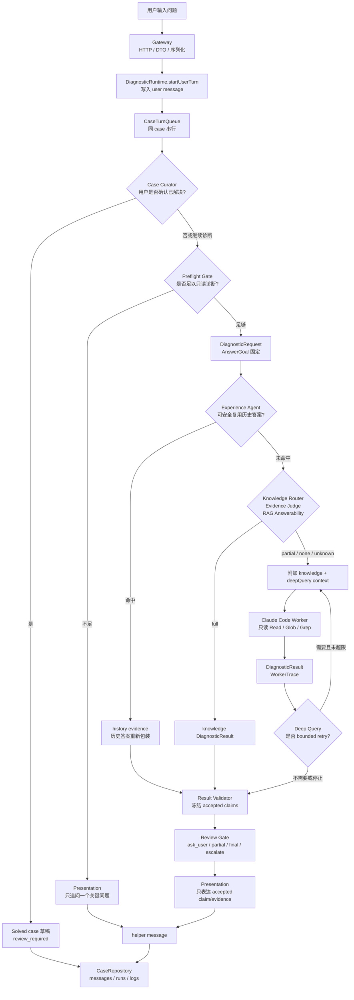

# Agent Runtime 技术总览

本文档组说明：用户输入一个问题之后，`super helper` 如何通过多个产品 Agent、知识检索、Claude Code worker、证据审核和 Presentation 共同产出最终回答。

本目录记录当前实现方案，不是新的产品 Agent 配置。产品 Agent 配置仍以 [`src/agents/`](../../src/agents/README.md) 和 [`src/agents/registry.json`](../../src/agents/registry.json) 为准；仓库开发规则仍以 [`AGENTS.md`](../../AGENTS.md)、[`docs/development-standards.md`](../development-standards.md) 和 [`docs/module-boundary-standards.md`](../module-boundary-standards.md) 为准。

## 阅读路径

1. [用户回合生命周期](turn-lifecycle.md)：从 `/api/chat` 到 helper reply 的同步/异步执行链路。
2. [Agent 分工协作](agent-collaboration.md)：每个产品 Agent 做什么、不做什么，以及如何交接。
3. [契约与数据流](contracts-and-data-flow.md)：`ResolvedTurnContext`、`AnswerGoal`、`DiagnosticRequest`、`DiagnosticResult`、Evidence、Claim、case/run/log 的数据边界。
4. [知识库、Worker 与 Review 流程](knowledge-worker-review-flow.md)：Experience miss 后如何先知识、再代码、再审核。
5. [可观测性与运维语义](observability-and-operations.md)：诊断日志、Agent activity、失败降级和 solved case 沉淀。

配套权威来源：

- [技术架构](../technical-architecture.md)
- [Agent 设计](../agent-design.md)
- [diagnostic-agent-runtime OpenSpec](../../openspec/specs/diagnostic-agent-runtime/spec.md)
- [deterministic-output-review OpenSpec](../../openspec/specs/deterministic-output-review/spec.md)
- [multi-agent-configuration OpenSpec](../../openspec/specs/multi-agent-configuration/spec.md)
- [knowledge-diagnosis-hardening OpenSpec](../../openspec/specs/knowledge-diagnosis-hardening/spec.md)

## 一句话模型

`super helper` 不是把用户原话直接丢给 Claude Code。它先把问题归一化为当前回合的 `AnswerGoal`，再按顺序尝试 Preflight、历史经验、知识库证据、代码只读调查，最后只允许通过确定性审核的 `primary_answer` claim 进入用户可见回复。

## 总览图

先看这张图即可抓住主链路：用户问题进入后，runtime 会先决定“能不能诊断”，再按成本从低到高依次尝试历史经验、知识库、代码只读调查，最后统一进入 Review 和 Presentation。

## 端到端主流程

主流程固定由 runtime 编排，分支只影响“证据从哪里来”，不影响“证据必须统一审核后才能回复用户”这个约束。

| 分支 | 何时结束本轮 | 用户看到什么 |
| --- | --- | --- |
| Preflight 追问 | 输入不足或权限边界不清 | 一个聚焦问题 |
| Experience 命中 | 历史答案仍覆盖当前 `AnswerGoal` | 重新审核后的历史答案 |
| Knowledge full | 知识证据过 Evidence Judge 且覆盖 `AnswerGoal` | 知识直答 |
| Knowledge partial/none/unknown | 知识不足以回答 | 升级 worker 后的 reviewed 结果 |
| Worker partial/final/escalate | 只读代码调查后进入 Review | partial、final 或人工升级说明 |

## 关键原则

- Gateway 只做 HTTP、DTO、状态码和序列化，不做 Preflight、worker dispatch、证据审核或最终回复格式化。
- Runtime 拥有一个用户回合的业务编排：Preflight、Experience、Knowledge、Worker、Review、Presentation、event recording。
- `src/agents/` 只存产品 Agent 配置和 stage pairing；Agent prompt 不应散落在 runtime、worker 或普通 docs 中。
- Workers 是工具，不是产品 Agent。Claude Code 和 MCP 只能返回证据或结构化结果，不能直接回复用户。
- `AnswerGoal` 是当前回合用户可见目标。`diagnosticObjective` 可以指导内部排查，但不能变成主回答。
- 最终回答必须先过 Evidence Review。没有 accepted `primary_answer` claim 覆盖 `answerGoal.mustAnswerItems` 时，不能形成 final answer。
- Presentation 只能选择和组织 accepted claim/evidence；不能提升 outcome、选择无关证据、补事实或泄漏内部 prompt/worker trace。
- 所有关键阶段都要写入诊断日志，日志是审计层，不是主聊天内容。

## 当前实现中的主要 Agent

| Agent | Stage | 主要职责 | 可否产生用户可见文本 |
| --- | --- | --- | --- |
| Main Agent | `main` | 回合所有权、`AnswerGoal` 所有权、最终回复责任 | 可以 |
| Input Review Agent | `input_review` / `preflight` | 判断是否追问或派发，只能用当前 case/context | 可以追问 |
| Experience Agent | `experience` | 复用同 tenant/user/workspace 的历史已审核答案 | 不直接产生 |
| Knowledge Router Agent | `knowledge_router` | 归一化问题，识别 module/intent/keywords/code escalation signals | 不直接产生 |
| Evidence Judge Agent | `evidence_judge` | 判断知识证据是否足够直答，或是否升级代码/人工 | 不直接产生 |
| RAG Answerability Agent | `rag_answerability` | 判断知识证据是否覆盖 `AnswerGoal`，partial 时萃取可保留结论 | 不直接产生 |
| Output Review Agent | `output_review` | 确定性证据审核、冻结 outcome 和 accepted IDs | 不直接产生 |
| Presentation Agent | `presentation` | 基于冻结结果做 persona-aware 中文表达 | 可以 |
| Case Curator Agent | `case_curator` | 用户确认解决后生成 `review_required` solved case 草稿 | 不直接产生 |

## 用户问题如何被“回答出来”

用户可见回答不是单个模型一次生成的结果，而是多段可审计结果的合成：

1. `ResolvedTurnContext` 决定当前有效问题、事实、用户主张、假设和未知。
2. `AnswerGoal` 固定用户真正要被回答的问题和必须覆盖的条目。
3. Preflight 决定当前是否足以只读诊断；不足时只追问一个关键问题。
4. Experience/Knowledge/Worker 产出 evidence 和 claims。
5. Result Validator 丢弃无证据 fact、非法 evidence reference、缺失 `role/answers` 的 claim。
6. Review Gate 只有在 accepted `primary_answer` 覆盖 `AnswerGoal.mustAnswerItems` 时才允许 final。
7. Presentation 把冻结结果翻译成适合运营、支持、客户或开发视角的中文，但不改变事实。

## 不在本目录解释的内容

- 知识库 intake/extract/normalize/slice/audit/publish 的全流程细节：见 [technical-architecture](../technical-architecture.md) 和 [knowledge-diagnosis-hardening spec](../../openspec/specs/knowledge-diagnosis-hardening/spec.md)。
- Provider adapter 协议、embedding/rerank 实现：见 [`src/providers/`](../../src/providers/) 和 provider 相关 OpenSpec。
- UI 具体 DOM/CSS 实现：见 [`src/ui.ts`](../../src/ui.ts) 及 UI 模块。
- 仓库开发规范：见 [`AGENTS.md`](../../AGENTS.md) 和 [`docs/development-standards.md`](../development-standards.md)。
