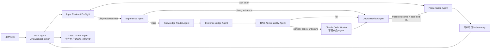
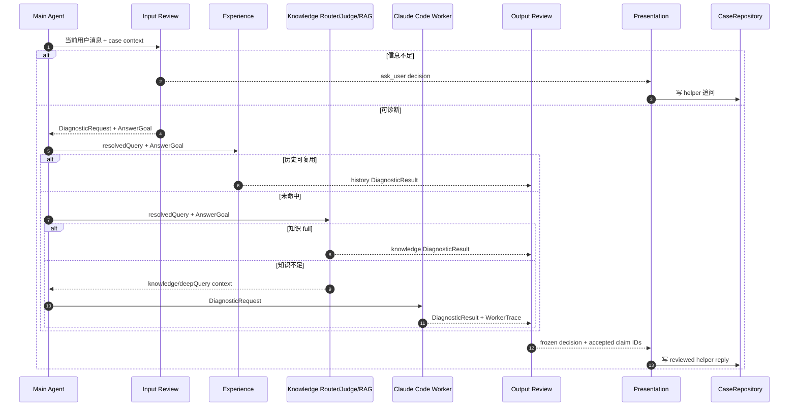

# Agent 分工协作

[返回总览](README.md)

本文说明当前产品 Agent 如何协作。这里的 Agent 是 `super helper` 产品运行时角色，不是仓库里的 coding agent，也不是 Claude Code worker。

## 配置来源

权威配置目录是 [`src/agents/`](../../src/agents/README.md)。runtime 通过 [`src/runtime/agent-configs.ts`](../../src/runtime/agent-configs.ts) 读取 [`registry.json`](../../src/agents/registry.json)，把 stage 映射到对应 markdown 配置。

`registry.json` 中的 `executionMode` 说明阶段权威边界：

- `deterministic`：实现以本地规则和 runtime 代码为准。
- `model_assisted`：可以调用 Agent model，但模型输出必须被 runtime 校验或可降级。
- `presentation_only`：只负责表达，不允许改变事实、outcome 或证据边界。

## 协作总图

这张图只展示产品 Agent 的交接，不把 Claude Code 画成 Agent。Claude Code 是 worker/tool，只能补证据。

## 协作时序图

## Main Agent

配置：[`src/agents/main.md`](../../src/agents/main.md)

职责：

- 拥有当前回合的 `AnswerGoal`。
- 规定“不能乱猜”和证据优先原则。
- 协调 Preflight、Experience、Knowledge、Worker、Review、Presentation。
- 对最终用户可见回复负责。

不负责：

- 直接执行代码、MCP 或 Claude Code。
- 绕过 Evidence Review 输出最终结论。
- 使用其他 tenant/user/case/workspace 的隐藏记忆。

Main Agent 的所有权在实现上体现为：`DiagnosticRuntime` 总是先建立 case context，再让各阶段围绕同一个 `DiagnosticRequest.answerGoal` 运行。

## Input Review / Preflight Agent

配置：[`src/agents/input-review.md`](../../src/agents/input-review.md)  
阶段：`input_review`、`preflight`

职责：

- 判断用户输入是否足以进行安全、只读、有意义的下一步诊断。
- 缺少阻塞信息时只问一个聚焦问题。
- 用户回答“不清楚”时保留未知，不编造事实。
- 当前 workspace 已选中且问题有可搜索信号时，倾向于先只读诊断。

实现边界：

- 本地规则在 [`src/runtime/preflight-decision.ts`](../../src/runtime/preflight-decision.ts)。
- 本地规则 + 可选模型协调在 [`src/runtime/preflight-service.ts`](../../src/runtime/preflight-service.ts)。
- 模型预检失败时降级到本地规则。
- 模型可以降级本地 fact，但不能把 hypothesis/unknown 提升为 fact，也不能替换 runtime 的 resolved query。

输出：

- `ask_user`：runtime 写入追问并结束本轮。
- `dispatch`：附带结构化 `DiagnosticRequest`。

## Experience Agent

配置：[`src/agents/experience.md`](../../src/agents/experience.md)  
阶段：`experience`

职责：

- 在同 tenant、同 user、同 workspace 范围内查找相似历史问题。
- 只复用有 reply-to/source-run 归因的历史答案。
- 重新校验证据 freshness、visibility、quality、status 和当前 `AnswerGoal` 覆盖情况。
- 将复用结果包装成 `history` evidence，再交给 Output Review 和 Presentation。

实现：

- 匹配和复核在 [`src/runtime/experience-agent.ts`](../../src/runtime/experience-agent.ts)。
- 回合接入在 [`src/runtime/experience-turn.ts`](../../src/runtime/experience-turn.ts)。

不能做：

- 不能跨 tenant/user/workspace 复用。
- 不能复用过期、低质量、不可见或不覆盖当前 `AnswerGoal` 的历史回答。
- 不能直接把历史 helper reply 原样绕过审核展示给用户。

## Knowledge Router Agent

配置：[`src/agents/knowledge-router.md`](../../src/agents/knowledge-router.md)  
阶段：`knowledge_router`

职责：

- 归一化用户问题。
- 识别 module candidates、intent candidates、keywords、source types。
- 标记 code escalation signals 和 high-risk signals。

实现入口在 [`src/runtime/knowledge-diagnosis.ts`](../../src/runtime/knowledge-diagnosis.ts)，底层依赖 [`src/knowledge/`](../../src/knowledge/) taxonomy 和 [`src/retrieval/`](../../src/retrieval/) service。

Knowledge Router 不产生最终答案，只为检索和 Evidence Judge 提供路由信号。

## Evidence Judge Agent

配置：[`src/agents/evidence-judge.md`](../../src/agents/evidence-judge.md)  
阶段：`evidence_judge`

职责：

- 判断知识 evidence pack 是否可直接回答。
- 执行 fail-closed 门禁：active、fresh、`ok|info` 质量、完整 provenance、答案片段、模块匹配、无冲突/高风险。
- 对实现细节、低质量、泛词命中、过期、冲突和高风险问题阻断直答。
- 决定 `final_answer`、`dispatch_code_diagnosis` 或 `escalate_to_human`。

实现：[`src/runtime/evidence-judge.ts`](../../src/runtime/evidence-judge.ts)

Evidence Judge 的结论仍不是用户最终回复；知识直答也必须进入 Output Review 和 Presentation。

## RAG Answerability Agent

配置：[`src/agents/rag-answerability.md`](../../src/agents/rag-answerability.md)  
阶段：`rag_answerability`

职责：

- 拿 `AnswerGoal + top-N knowledge evidence` 判断 `full | partial | none | unknown`。
- `full` 必须提供 covered claims，且覆盖所有 `answerGoal.mustAnswerItems`。
- `partial` 必须输出可保留 covered claims、missing elements、escalation focus。
- `none/unknown` 默认保守升级代码诊断。

实现：[`src/runtime/rag-answerability-service.ts`](../../src/runtime/rag-answerability-service.ts)

RAG Answerability 是 model-assisted，但 runtime 会校验 evidence IDs 和 covered requirement IDs。校验失败会保守返回 `unknown` 并升级。

## Claude Code Worker

Claude Code 不是产品 Agent。它是 [`DiagnosticWorker`](../../src/workers/diagnostic-worker.ts) 的一个 adapter。

职责：

- 根据 `DiagnosticRequest` 做只读 workspace inspection。
- 只能使用配置允许的 read-oriented 工具，默认 `Read`、`Glob`、`Grep`。
- 返回结构化 `DiagnosticResult` 和 `WorkerTrace`。

不能做：

- 不能写用户最终回复。
- 不能修改文件、执行项目命令、启动服务、访问数据库或外部系统。
- 不能把 CLI stdout/stderr 当成主聊天内容。
- 不能拥有长期 case memory。

相关实现：

- Prompt：[`src/workers/claude/claude-prompts.ts`](../../src/workers/claude/claude-prompts.ts)
- Policy：[`src/workers/claude/claude-policy.ts`](../../src/workers/claude/claude-policy.ts)
- CLI：[`src/workers/claude/claude-cli.ts`](../../src/workers/claude/claude-cli.ts)
- Output parser：[`src/workers/claude/claude-output-parser.ts`](../../src/workers/claude/claude-output-parser.ts)

## Output Review Agent

配置：[`src/agents/output-review.md`](../../src/agents/output-review.md)  
阶段：`output_review`

职责：

- 审核 `DiagnosticResult` 中的 evidence 和 claims。
- 阻止 unsupported fact、非法 evidence reference、缺少 `role/answers` 的 claim。
- 冻结 accepted claim IDs、rejected claim IDs 和 accepted primary answer claim IDs。
- 决定本轮 outcome：`ask_user`、`partial`、`final`、`escalate`。

实现：

- 确定性校验：[`src/runtime/result-validator.ts`](../../src/runtime/result-validator.ts)
- outcome 映射：[`src/runtime/review-gate.ts`](../../src/runtime/review-gate.ts)
- Review + Presentation 编排：[`src/runtime/review-presentation.ts`](../../src/runtime/review-presentation.ts)

Output Review 之后的 outcome 是冻结的，Presentation 无权提升。

## Presentation Agent

配置：[`src/agents/presentation.md`](../../src/agents/presentation.md)  
阶段：`presentation`

职责：

- 根据用户 persona 组织中文表达。
- 只使用 accepted claims/evidence/missingInfo。
- 先表达冻结的 `primary_answer`。
- 返回 `answerTarget`、`directAnswer`、`reply`、`claimIds`、`evidenceIds`、`directAnswerClaimIds` 供 runtime 二次校验。

不能做：

- 不能改 outcome。
- 不能用问题类型或中文问法列表自行选择主答案。
- 不能添加 accepted claims 外的新事实。
- 非开发视角不能暴露 `src/`、`knowledge/_sources`、case/run id、worker command、raw stdout/stderr 或内部 prompt。

模型 Presentation 失败或校验失败时，runtime 使用 [`src/runtime/presenter.ts`](../../src/runtime/presenter.ts) 的 rule-based fallback。

## Case Curator Agent

配置：[`src/agents/case-curator.md`](../../src/agents/case-curator.md)  
阶段：`case_curator`

职责：

- 当用户确认问题已解决，并且当前 case 有可沉淀的 evidence-backed concluded run 时，生成 solved case 草稿。
- 草稿默认 `status: review_required`、`confidence: medium`。
- 标记知识索引 dirty，等待人工复核和后续 reindex。

实现：

- 接入：[`src/runtime/case-curation-service.ts`](../../src/runtime/case-curation-service.ts)
- 草稿生成：[`src/runtime/case-curator.ts`](../../src/runtime/case-curator.ts)

## 协作不变量

- 所有 Agent 阶段都围绕同一个 `AnswerGoal`。
- 任一阶段的 partial 信息不能丢弃；可保留结论进入后续上下文，缺口交给下一阶段补齐。
- 任何 worker/tool 输出都必须经 Output Review。
- Presentation 只表达，不裁决。
- 用户最终看到的是 Main Agent 负责的 reviewed reply，不是某个子 Agent 或 worker 的直接输出。
