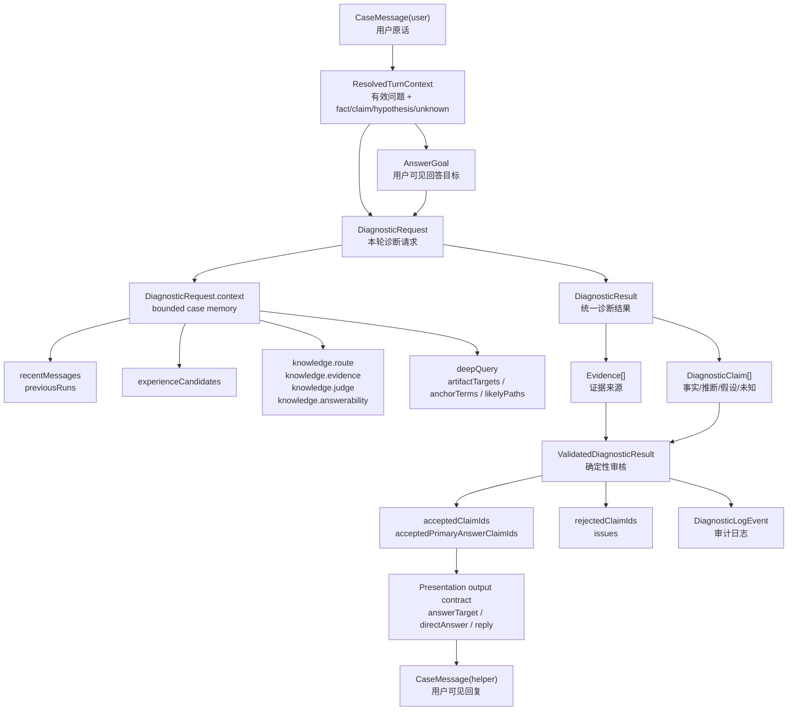
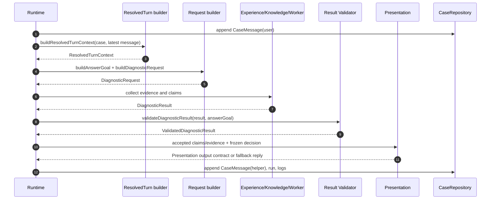

# 契约与数据流

[返回总览](README.md)

本文说明用户问题在 runtime 内部如何变成结构化目标、诊断请求、证据、claim、审核结果和最终回复。

## 数据流总览



`CaseSession` 是持久化主对象，包含 `messages`、`runs`、`logs`、`status`、`userPersona` 和 workspace 归属。任何阶段要读取上下文，都应从 case repository 派生 bounded context，而不是依赖 worker 自己的长期记忆。

## 对象生成时序图



## ResolvedTurnContext

定义：[`src/domain.ts`](../../src/domain.ts)  
构建：[`src/runtime/resolved-turn.ts`](../../src/runtime/resolved-turn.ts)

`ResolvedTurnContext` 是当前回合的有效问题解析结果，负责把原始聊天拆成可追踪的上下文：

- `resolvedQuery`：当前阶段使用的有效问题，也是 Experience、Knowledge Router、Retrieval、Deep Query、`DiagnosticRequest.userGoal` 和 Worker 的共同查询基础。
- `latestUserMessage`：用户本轮原话，用于审计和保持原始输入。
- `confirmedFacts`：本地规则识别出的可观察事实。
- `userClaims`：用户主张，不能直接当事实。
- `hypotheses`：用户猜测或假设，不能提升成事实。
- `unknowns`：用户明确不知道或仍缺失的信息。
- `sourceMessageIds`：支撑当前解析的消息来源。

模型辅助 Preflight 可以把本地 fact 降级为 claim/hypothesis/unknown，但不能替换 `resolvedQuery`，也不能把用户假设或未知提升成 fact。

## AnswerGoal

定义：[`src/domain.ts`](../../src/domain.ts)  
构建：[`src/runtime/answer-goal.ts`](../../src/runtime/answer-goal.ts)

`AnswerGoal` 是用户可见回答目标，不是内部排查任务。当前字段含义：

- `rawUserQuestion`：本轮用户原话。
- `resolvedQuestion`：结合上下文后的用户真实问题。
- `answerObject`：问题对象，优先从路径/文件名推断，否则取问题摘要。
- `mustAnswerItems`：最终主答必须覆盖的条目；当前默认是 `direct_answer`。
- `diagnosticObjective`：内部只读诊断目标，可以指导调查，但不能替代用户可见问题。
- `sourceMessageIds`：目标来自哪些用户消息。

所有 Agent 阶段都围绕同一个 `AnswerGoal`。Deep Query follow-up 只能更新 `diagnosticObjective`，不能把主问题换成内部过程问题。

## DiagnosticRequest

定义：[`src/domain.ts`](../../src/domain.ts)  
构建：[`src/runtime/request-builder.ts`](../../src/runtime/request-builder.ts)  
case context：[`src/sessions/context-builder.ts`](../../src/sessions/context-builder.ts)

`DiagnosticRequest` 是 runtime 发给 worker 的结构化请求，不是用户原始 chat。核心字段：

- `caseId` / `runId` / `workspaceId` / `claudeSessionId`：隔离和审计身份。
- `answerGoal`：当前回合权威回答目标。
- `userGoal`：给检索和 worker 使用的有效查询。
- `knownFacts` / `unknowns`：来自 `ResolvedTurnContext` 和 Preflight。
- `constraints`：只读、结构化输出、不得无证据结论、优先回答 `AnswerGoal` 等约束。
- `allowedMcpToolIds`：当前 workspace 允许的 MCP 工具 ID。
- `userPersona`：运营、支持、客户或开发视角。
- `context`：bounded case memory 和各阶段附加信息。

`DiagnosticRequest.context` 是跨阶段交接的主容器。Experience 会记录候选和拒绝原因；Knowledge 会记录 route、evidence、judge、answerability；Deep Query 会记录 artifact targets、anchor terms、likely paths、重试次数和 pivot 原因。

## Evidence 与 DiagnosticClaim

定义：[`src/domain.ts`](../../src/domain.ts)

`Evidence` 记录证据来源：

- `kind`：`workspace`、`mcp`、`manual`、`knowledge`、`history`、`log` 或 `unknown`。
- `source`：文件、知识片段、历史 run、日志或工具来源。
- `summary`：证据摘要。
- `confidence`：`low`、`medium`、`high`。
- `validation`：可选的 active/status/visibility/quality 信息。

`DiagnosticClaim` 记录要进入回答候选池的主张：

- `type`：`fact`、`inference`、`assumption`、`unknown`。
- `role`：`primary_answer`、`supporting_context`、`evidence_locator`、`process_note`、`next_action`、`unknown`。
- `text`：claim 文本。
- `evidenceIds`：引用的证据 ID。
- `answers`：该 claim 覆盖哪些 `answerGoal.mustAnswerItems`。

事实和推断必须引用存在的 evidence；事实还必须有 medium/high confidence evidence。`primary_answer` 必须通过 `answers` 覆盖 `answerGoal.mustAnswerItems` 才能成为 final answer 的主答依据。

## DiagnosticResult

定义：[`src/domain.ts`](../../src/domain.ts)  
worker adapter：[`src/workers/diagnostic-worker.ts`](../../src/workers/diagnostic-worker.ts)

`DiagnosticResult` 是 Experience、Knowledge 或 Worker 返回给 Review 的统一结果：

- `status`：`need_input`、`partial`、`concluded`。
- `summary`：诊断摘要，不等于最终回复。
- `missingInfo`：还缺哪些信息或证据。
- `evidence`：本轮证据。
- `claims`：本轮可审核 claim。
- `recommendedNextAction`：`ask_user`、`continue_diagnosis`、`final_answer`、`escalate_to_human`。

任何 `DiagnosticResult` 都不能直接展示给用户；它必须经过确定性审核和 Presentation。

## Review 冻结点

确定性校验：[`src/runtime/result-validator.ts`](../../src/runtime/result-validator.ts)  
Review Gate：[`src/runtime/review-gate.ts`](../../src/runtime/review-gate.ts)  
Review + Presentation：[`src/runtime/review-presentation.ts`](../../src/runtime/review-presentation.ts)

`validateDiagnosticResult` 会产出 `ValidatedDiagnosticResult`：

- `result`：被降级或清理后的结果。
- `issues`：重复 evidence、缺 evidence reference、低置信 fact、非法 claim type、缺 role、缺 answers、缺 primary answer 等问题。
- `acceptedClaimIds`：通过审核的 claim。
- `rejectedClaimIds`：被拒绝的 claim。
- `acceptedPrimaryAnswerClaimIds`：覆盖 `AnswerGoal` 的 `primary_answer` claim。

Review Gate 根据 validated result 冻结用户可见 decision 和 case status。模型 Presentation 无权修改 status、outcome、recommended action 或 accepted IDs。

## Presentation Output Contract

配置：[`src/agents/presentation.md`](../../src/agents/presentation.md)  
校验：[`src/runtime/review-presentation.ts`](../../src/runtime/review-presentation.ts)  
降级 formatter：[`src/runtime/presenter.ts`](../../src/runtime/presenter.ts)

模型 Presentation 只能返回 JSON：

```json
{
  "answerTarget": "用户真实问题",
  "directAnswer": "第一句要正面回答的内容",
  "reply": "最终用户可见中文回复",
  "claimIds": ["claim_1"],
  "evidenceIds": ["ev_1"],
  "directAnswerClaimIds": ["claim_1"]
}
```

runtime 会校验：

- `claimIds` 只能选择 accepted claims，且非空。
- `evidenceIds` 必须存在，并覆盖所选 claims 引用的全部 evidence。
- 有 frozen primary answer 时，`directAnswerClaimIds` 必须与 `acceptedPrimaryAnswerClaimIds` 是同一组 ID。
- 第一段必须覆盖 `directAnswer`。
- 非开发视角不能暴露内部文件路径、case/run id、worker command、stdout/stderr 或 prompt。
- reply 不能包含未选择 claim 的文本信号，不能添加新事实。

校验失败时使用本地 rule-based fallback。fallback 也只使用已审核 claim、evidence、missingInfo 和 `AnswerGoal`。

## 持久化边界

- `messages` 保存用户和 helper 可见对话；helper reply 必须由 runtime 写入。
- `runs` 保存每次诊断的 `DiagnosticRequest`、`DiagnosticResult` 和 `WorkerTrace`。
- `logs` 保存阶段事件和审计 detail；日志可展示过程，但不是主聊天内容。
- `case.status` 由 Review/Preflight/Worker 流程决定，route 只序列化。

修改这些 shape 时必须有迁移策略和测试，不能为了某个 Agent 阶段临时塞私有字段。
