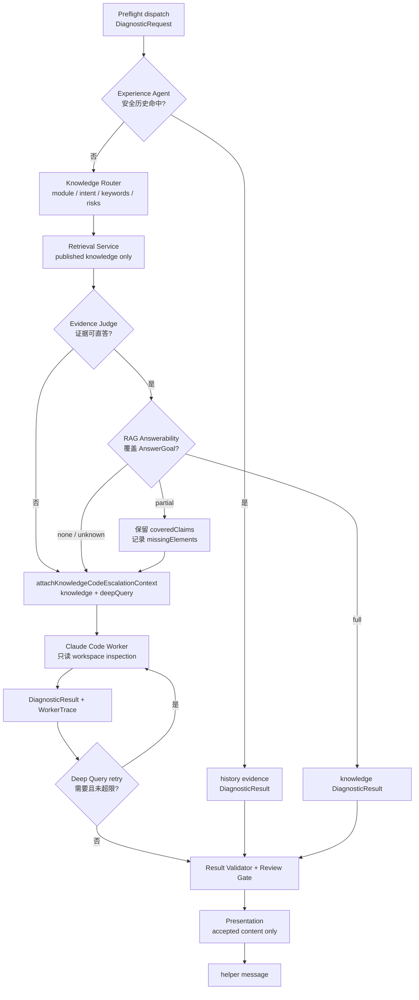
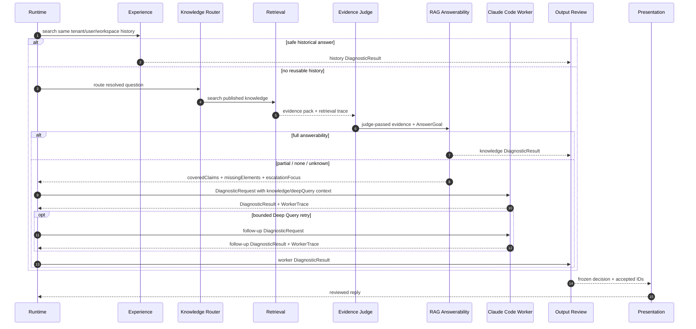

# 知识库、Worker 与 Review 流程

[返回总览](README.md)

本文说明 Preflight 允许派发之后，系统如何先尝试历史经验和知识库，再必要时升级 Claude Code worker，最后通过 Review 和 Presentation 生成回答。

## 总体分支

这条链路的关键点是：知识库和 worker 都只是证据来源。用户最终看到的回复只来自 reviewed claims，不来自检索结果原文或 worker stdout。

## 知识到代码升级时序图

## Experience 优先

实现：

- [`src/runtime/experience-turn.ts`](../../src/runtime/experience-turn.ts)
- [`src/runtime/experience-agent.ts`](../../src/runtime/experience-agent.ts)
- [`src/agents/experience.md`](../../src/agents/experience.md)

Experience 在同 tenant、同 user、同 workspace 内寻找历史已审核答案。可复用条件包括：

- 有明确 reply-to/source-run 归因。
- 历史 run 的 result 能通过当前 Review 约束。
- 历史 evidence 对当前 persona 可见。
- 历史结论仍然 active/fresh/quality 合格。
- 历史 `primary_answer` 覆盖当前 `AnswerGoal`。

命中后，runtime 会把历史结果改写成 `history` evidence，再进入 Output Review 和 Presentation。未命中或候选被拒绝时，候选和拒绝原因写入 `DiagnosticRequest.context.experienceCandidates`，流程继续到知识库。

## Knowledge Router

实现：

- [`src/runtime/knowledge-diagnosis.ts`](../../src/runtime/knowledge-diagnosis.ts)
- [`src/agents/knowledge-router.md`](../../src/agents/knowledge-router.md)
- [`src/knowledge/`](../../src/knowledge/)
- [`src/retrieval/`](../../src/retrieval/)

Knowledge Router 使用当前有效问题识别：

- `normalizedQuestion`
- `moduleCandidates`
- `intentCandidates`
- `keywords`
- `sourceTypes`
- `codeEscalationSignals`
- `risks`

这些信号决定检索路由、Evidence Judge 判断维度和 Deep Query 的初始 artifact targets。Knowledge Router 不输出最终结论。

## Retrieval 与 Evidence Pack

检索读取已发布知识索引，不能把 draft、repair plan 或 review queue 当 active knowledge。当前知识证据会带上：

- source document / block provenance
- section path
- answer span
- confidence
- quality status
- retrieval trace
- matched terms

Evidence Judge 只允许 active、fresh、`ok|info`、溯源完整、answer span 明确且置信条件达标的知识证据直答。`warn|error`、过期、未知 module、实现细节不足、冲突、高风险或只相关不回答的问题都会阻断直答。

## Evidence Judge

实现：[`src/runtime/evidence-judge.ts`](../../src/runtime/evidence-judge.ts)  
配置：[`src/agents/evidence-judge.md`](../../src/agents/evidence-judge.md)

Evidence Judge 输出知识证据是否可用：

- `answerable`
- `confidence`
- `need_code_escalation`
- `reason`
- `evidence`
- `risks`
- `missing_info`
- `conflicts`
- `recommended_next_action`
- `answer_score`

Evidence Judge 可以建议知识直答、代码升级或人工升级，但仍不是最终回复裁决。它的结论会继续经过 RAG Answerability 和 Output Review。

## RAG Answerability

实现：[`src/runtime/rag-answerability-service.ts`](../../src/runtime/rag-answerability-service.ts)  
配置：[`src/agents/rag-answerability.md`](../../src/agents/rag-answerability.md)

RAG Answerability 拿 `AnswerGoal + top-N evidence` 判断证据是否真正回答了问题：

| 结果 | runtime 行为 |
| --- | --- |
| `full` | 允许知识结果进入 Review + Presentation，前提是 Evidence Judge 也通过 |
| `partial` | 保留 `coveredClaims`，把 `missingElements` 和 `escalationFocus` 写入 request context，然后升级 worker |
| `none` | 知识不能回答，升级 worker |
| `unknown` | 默认保守；需要升级时升级 worker |

`full` 必须覆盖全部 `answerGoal.mustAnswerItems`。`partial` 不能被丢弃，已覆盖的 claim 会作为上下文传给 worker，但不能当作缺失项的最终证明。

## 知识直答路径

当 Evidence Judge 和 RAG Answerability 都允许直答时：

1. [`diagnosticResultFromKnowledge`](../../src/runtime/knowledge-diagnosis.ts) 把知识 evidence pack 转成 `DiagnosticResult`。
2. runtime 创建 run，并把 request/result 写入 case。
3. `ReviewPresentationService` 做确定性审核。
4. Presentation 表达 accepted claims。
5. helper message 落盘。

知识直答仍然要求 accepted `primary_answer` 覆盖 `AnswerGoal`；否则 Review 会降级为 partial/ask_user。

## 代码升级路径

实现：

- [`src/runtime/knowledge-turn.ts`](../../src/runtime/knowledge-turn.ts)
- [`src/runtime/deep-query-planner.ts`](../../src/runtime/deep-query-planner.ts)
- [`src/runtime/worker-diagnosis.ts`](../../src/runtime/worker-diagnosis.ts)

知识不足时，runtime 调用 `attachKnowledgeCodeEscalationContext`：

- 把 route、evidence、judge、answerability 写入 `DiagnosticRequest.context.knowledge`。
- 把 artifact targets、anchor terms、likely paths、avoid assumptions 写入 `DiagnosticRequest.context.deepQuery`。
- 记录 `code_escalation_requested` 日志。

这样 worker 收到的不是一个泛化问题，而是带有已知证据、缺失要素和候选路径的只读调查请求。

## Claude Code Worker

实现：

- Port：[`src/workers/diagnostic-worker.ts`](../../src/workers/diagnostic-worker.ts)
- Adapter：[`src/workers/claude/claude-code-worker.ts`](../../src/workers/claude/claude-code-worker.ts)
- Prompt：[`src/workers/claude/claude-prompts.ts`](../../src/workers/claude/claude-prompts.ts)
- Policy：[`src/workers/claude/claude-policy.ts`](../../src/workers/claude/claude-policy.ts)
- Parser：[`src/workers/claude/claude-output-parser.ts`](../../src/workers/claude/claude-output-parser.ts)

Worker 的责任是只读检查 workspace，并返回 `DiagnosticResult + WorkerTrace`。它不能：

- 直接回复用户。
- 修改文件。
- 启动服务或执行项目命令。
- 访问未授权外部系统。
- 使用长期隐藏记忆替代 `DiagnosticRequest.context`。

Claude Code prompt 明确要求优先回答 `DiagnosticRequest.answerGoal.mustAnswerItems`，并在缺证据时返回 unknown/missingInfo，而不是编造 final answer。

## Deep Query Retry

实现：

- [`src/runtime/worker-turn.ts`](../../src/runtime/worker-turn.ts)
- [`src/runtime/request-builder.ts`](../../src/runtime/request-builder.ts)

当第一轮 worker 结果仍不足，且 Review 判断可以继续只读追查时，runtime 会生成 follow-up `DiagnosticRequest`：

- 保留原 `AnswerGoal`。
- 更新 `diagnosticObjective` 为继续追查。
- 把上一轮 evidence/claims 汇入 known facts。
- 使用 Deep Query correction 选择新的 artifact targets。
- 限制最大尝试次数和已尝试 query。

Deep Query retry 是 bounded retry，不是无限自动循环。达到停止条件时，当前 partial 结果会进入 Presentation，而不是继续消耗 worker。

## Review 与 Presentation

实现：

- [`src/runtime/result-validator.ts`](../../src/runtime/result-validator.ts)
- [`src/runtime/review-gate.ts`](../../src/runtime/review-gate.ts)
- [`src/runtime/review-presentation.ts`](../../src/runtime/review-presentation.ts)
- [`src/runtime/presenter.ts`](../../src/runtime/presenter.ts)

Review 处理所有来源的 `DiagnosticResult`，包括 history、knowledge、worker 和 worker failure parser。它会：

- 丢弃缺证据或引用非法 evidence 的 claim。
- 要求 fact 有 medium/high confidence evidence。
- 要求 claim 声明 `role` 和 `answers`。
- 冻结 accepted/rejected claim IDs。
- 冻结 accepted primary answer claim IDs。
- 把 invalid final answer 降级为 partial/ask_user。

Presentation 只表达 Review 冻结后的结果。模型输出失败、包含内部信息或引用越界时，fallback presenter 会用 accepted claims 生成保守回复。

## 分工边界

| 阶段 | 能做 | 不能做 |
| --- | --- | --- |
| Experience | 复用当前 scope 的已审核历史答案 | 跨用户/工作区复用，绕过 Review |
| Knowledge Router | 生成检索路由和升级信号 | 最终回答 |
| Evidence Judge | 判断知识证据是否可直答 | 替代 Output Review |
| RAG Answerability | 判断 evidence 是否覆盖 AnswerGoal | 新增事实或直接回复 |
| Claude Code Worker | 只读检查 workspace，返回结构化结果 | 修改项目、回复用户、持久化记忆 |
| Output Review | 冻结 accepted claims 和 outcome | 美化表达或补事实 |
| Presentation | 组织中文可见回复 | 修改 outcome、添加事实、泄漏内部 |
