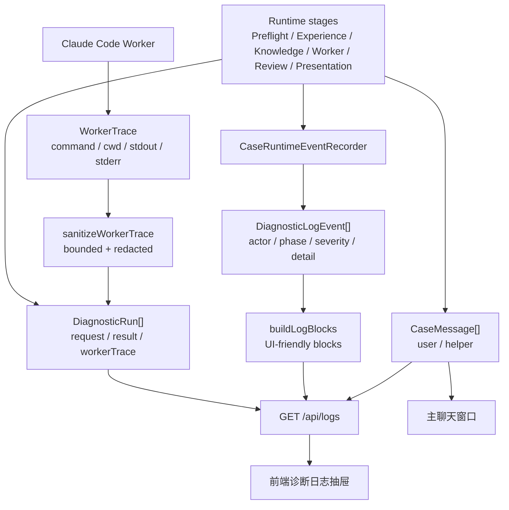
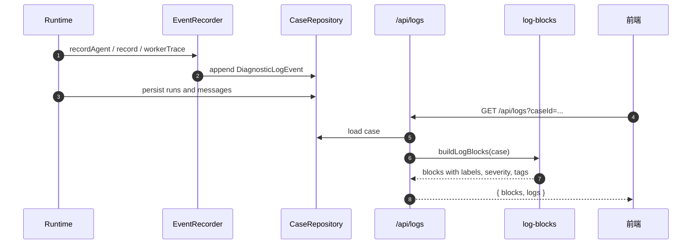

# 可观测性与运维语义

[返回总览](README.md)

本文说明 runtime 如何记录 Agent 活动、worker trace、诊断日志、失败降级和 solved case 沉淀。

## 可观测性总图

主聊天只展示 helper message；诊断过程进入日志和 run trace。这个分离很重要：日志帮助解释过程，但不能绕过 Review 变成用户最终回答。

## 日志读取时序图

## 日志对象

定义：[`src/domain.ts`](../../src/domain.ts)  
记录器：[`src/runtime/event-recorder.ts`](../../src/runtime/event-recorder.ts)

每条 `DiagnosticLogEvent` 包含：

- `actor`：`agent`、`claude`、`mcp` 或 `system`。
- `phase`：阶段名称，例如 `preflight_decision`、`knowledge_search_result`、`evidence_validation_result`。
- `summary`：面向日志抽屉的摘要。
- `severity`：`ok`、`warn`、`error`、`info`。
- `label`：UI 分组标签。
- `detail`：结构化细节，必须可安全展示或已脱敏。
- `agentId` / `agentRole` / `agentName`：产品 Agent 身份。

日志是审计层，不是主聊天内容。用户最终回复必须来自 Review + Presentation 写入的 helper message。

## Agent Activity

`CaseRuntimeEventRecorder` 使用 agent identity 记录各阶段：

- 输入：`input_received`
- 用户视角：`persona_agent_result`
- Preflight：`preflight_started`、`local_preflight_result`、`model_preflight_result`、`preflight_decision`
- Experience：`experience_started`、`experience_result`
- Knowledge：`knowledge_router_started`、`knowledge_search_result`、`evidence_judge_result`
- RAG：`rag_answerability_started`、`rag_answerability_result`
- 代码升级：`code_escalation_requested`
- Worker：`diagnostic_request`、worker trace
- Review：`evidence_review_started`、`evidence_validation_result`
- Presentation：`presentation_agent_result`、`user_reply`
- Case Curator：resolution/case curator 相关事件

这些事件让前端可以展示“各 Agent 怎么协作”，也让开发者能追踪某个结论来自哪条 evidence 和哪个 Review 冻结点。

## `/api/logs`

HTTP 入口：[`src/gateway/routes/log-routes.ts`](../../src/gateway/routes/log-routes.ts)  
展示转换：[`src/observability/log-blocks.ts`](../../src/observability/log-blocks.ts)

`GET /api/logs?caseId=...` 返回：

- `blocks`：结构化日志块，适合 UI 渲染。
- `logs`：兼容用的文本段落，包括 case 概览、Agent 工作链路、Claude Code 工作链路、MCP 工作链路、消息记录和诊断运行。

Gateway 这里只做读取、转换和序列化，不决定诊断流程，也不解释 evidence 是否足够。

## WorkerTrace 脱敏与边界

定义：[`src/domain.ts`](../../src/domain.ts)  
脱敏：[`src/observability/worker-trace.ts`](../../src/observability/worker-trace.ts)

`WorkerTrace` 包含：

- `command`
- `cwd`
- `stdout`
- `stderr`
- `exitCode` / `signal` / `error`
- `startedAt` / `finishedAt`

公开日志会通过 `sanitizeWorkerTrace` 做长度限制和 provider error redaction。worker command、cwd、stdout、stderr、stack、provider payload 和内部 prompt 只能进入 bounded diagnostic logs，不能被 Presentation 暴露给非开发视角用户。

如果 worker 在产出可用证据前失败，主回复只能表达安全失败类别、当前诊断状态、下一步动作和 case/run 身份；不能把 raw stderr/stdout 直接当回答。

## 状态与决策

case 状态：

- `collecting_input`
- `ready_for_diagnosis`
- `diagnosing`
- `need_input`
- `partial`
- `concluded`

run 状态：

- `queued`
- `running`
- `need_input`
- `partial`
- `concluded`
- `failed`
- `cancelled`

Review Gate 把 validated `DiagnosticResult` 映射为用户可见 decision 和 case status。常见语义：

- `ask_user`：需要用户补充关键输入或证据。
- `partial`：已有部分证据或初步判断，但没有覆盖 `AnswerGoal`。
- `final`：accepted `primary_answer` 覆盖 `AnswerGoal.mustAnswerItems`。
- `escalate`：需要人工或外部权限。

Presentation 不能把 `partial` 写成 `final`，也不能隐藏 missingInfo。

## 异步失败

实现：[`src/runtime/diagnostic-runtime.ts`](../../src/runtime/diagnostic-runtime.ts)

异步 chat 请求返回 `202 Accepted` 后，后台继续 `completeUserTurn`。如果后台抛出未处理异常，runtime 会：

- 将 case status 设为 `partial`。
- 记录 `turn_failed` 系统日志。
- 写入安全 helper reply，说明本轮处理中断。

Claude Code CLI 失败通常不会走这个路径；adapter 会把失败解析成结构化 `DiagnosticResult`，再进入 Review + Presentation。

## Solved Case 沉淀

实现：

- [`src/runtime/case-curation-service.ts`](../../src/runtime/case-curation-service.ts)
- [`src/runtime/case-curator.ts`](../../src/runtime/case-curator.ts)
- [`src/agents/case-curator.md`](../../src/agents/case-curator.md)

当用户确认问题已解决，且当前 case 有可沉淀的 evidence-backed concluded run，Case Curator 会生成 solved case 草稿：

- 默认 `status: review_required`。
- 默认 `confidence: medium`。
- 保留 evidence provenance。
- 标记知识索引 dirty，等待人工 review/publish/reindex。

Case Curator 不能把未审核聊天内容直接发布成 active knowledge。

## 运维排查入口

本地排查一个回答质量问题时，建议按顺序看：

1. `messages`：用户原话和 helper reply 是否正确对应。
2. `logs.blocks`：Preflight、Experience、Knowledge、Worker、Review、Presentation 的阶段是否完整。
3. `runs[*].request.answerGoal`：用户真实问题和 `mustAnswerItems` 是否正确。
4. `runs[*].request.context.knowledge`：知识路由、证据、judge、answerability 是否解释了直答或升级原因。
5. `runs[*].result.claims`：是否有 `role`、`answers` 和 evidence references。
6. `evidence_validation_result`：哪些 claim 被接受或拒绝。
7. `presentation_agent_result` 和 `user_reply`：模型 Presentation 是否通过，fallback 是否触发。

如果最终回答看起来偏题，优先检查 `AnswerGoal.resolvedQuestion` 和 frozen `acceptedPrimaryAnswerClaimIds`，不要先改 Presentation 文案。Presentation 只应表达已冻结的主答。
