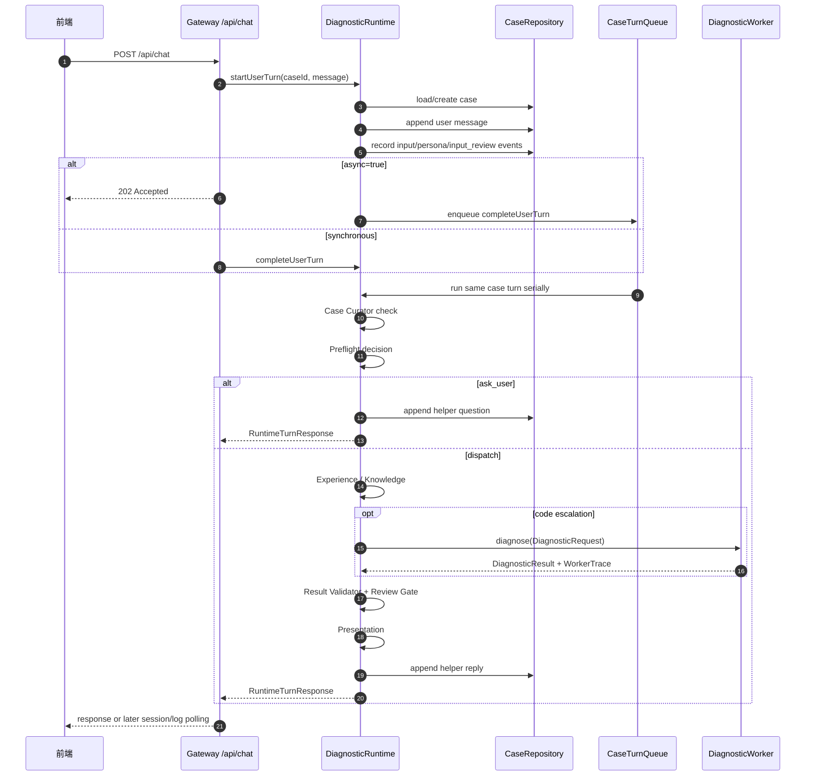
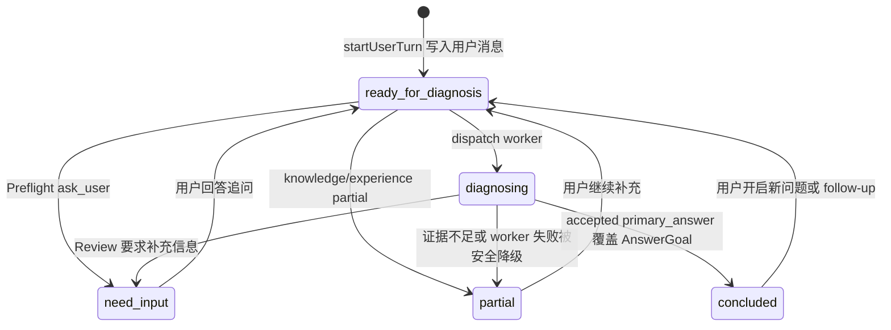

# 用户回合生命周期

[返回总览](README.md)

本文说明一个用户问题从 HTTP 请求进入系统，到 helper 回复落盘并返回前端的完整生命周期。

## 生命周期时序图

同步和异步请求共用同一条 runtime pipeline。区别只在于 Gateway 什么时候把 HTTP 响应返回给前端。



## 入口边界

HTTP 入口在 [`src/gateway/routes/chat-routes.ts`](../../src/gateway/routes/chat-routes.ts)。它只负责：

- 校验 `POST /api/chat`。
- 读取 `caseId`、`message`、`workspaceId`、`persona`、`async`。
- 阻止 archived case 继续聊天。
- 调用 [`DiagnosticRuntime`](../../src/runtime/diagnostic-runtime.ts)。
- 序列化响应 DTO 和 context usage。

Gateway 不负责判断是否追问、不构造 Claude prompt、不调用 worker、不审核证据、不格式化最终结论。

## 同步请求

同步请求没有 `async: true`，路由调用：

```text
DiagnosticRuntime.handleUserMessage
  -> startUserTurn
  -> completeUserTurn
```

`handleUserMessage` 只是把“写入用户消息”和“完成诊断”组合在一个 await 中，实际业务仍由 runtime 内部阶段负责。

## 异步请求

异步请求带 `async: true`，路由调用：

```text
DiagnosticRuntime.startUserTurn
  -> 立即返回 202 Accepted
  -> 后台调用 DiagnosticRuntime.completeUserTurn
  -> 出错时 recordTurnFailure
```

异步响应只表示本轮用户消息已被接受，不表示诊断已经完成。最终 helper reply 仍由同一套 `completeUserTurn` pipeline 写入 case；前端再通过 session/logs 读取状态。

## startUserTurn

`startUserTurn` 由 [`SessionLifecycle`](../../src/runtime/session-lifecycle.ts) 执行：

1. 根据 `caseId` 加载旧 case；没有则创建新 case。
2. 设置或继承 `userPersona`。
3. 如果是新会话，记录 `conversation_started`。
4. 用第一条有意义的用户消息刷新通用标题。
5. 写入 user message。
6. 记录 `input_received`、`persona_agent_result`、`input_review_started`。
7. 将 case 状态设为 `ready_for_diagnosis` 并保存。

这一步只建立当前回合的事实入口，不做诊断结论。

## completeUserTurn

`completeUserTurn(caseId, userMessage)` 通过 [`CaseTurnQueue`](../../src/runtime/turn-queue.ts) 串行同一个 case：

```text
turnQueue.run(caseId, completeUserTurnNow)
```

这保证同一个 case 内多个异步消息按提交顺序完成，每条被接受的 user message 都有自己的 helper reply。不同 case 可以并行。

`completeUserTurnNow` 的顺序是固定的：

1. `requireActiveCase` 加载未归档 case。
2. 计算当前 helper reply 应回复的 `replyToMessageId`。
3. `CaseCurationService` 检查用户是否确认“已解决”。
4. `PreflightService` 判断追问或派发。
5. `ExperienceTurnService` 尝试复用历史答案。
6. `KnowledgeTurnService` 尝试知识库直答或附加 code escalation context。
7. `WorkerDiagnosisService` 调用 worker 并处理 Deep Query retry。
8. `ReviewPresentationService` 审核并生成可见回复。
9. 写入 helper message，记录 `user_reply`。

## 状态流

case 的状态不是自由字符串，来自 [`CaseStatus`](../../src/domain.ts)：



| 状态 | 含义 |
| --- | --- |
| `collecting_input` | 预留的收集输入状态 |
| `ready_for_diagnosis` | 用户消息已写入，等待诊断 |
| `diagnosing` | worker 或诊断流程正在运行 |
| `need_input` | 当前证据不足，需要用户补充 |
| `partial` | 有部分结论或已尝试排查，但未满足 final 条件 |
| `concluded` | 已有 accepted `primary_answer` 支撑最终回答 |

run 的状态来自 [`DiagnosticRunStatus`](../../src/domain.ts)，表示单次诊断 run 的生命周期：`queued`、`running`、`need_input`、`partial`、`concluded`、`failed`、`cancelled`。

## 失败处理

异步后台执行抛错时，`recordTurnFailure` 会：

- 将 case 状态设为 `partial`。
- 记录 `turn_failed` 事件。
- 写入一个安全 helper reply，说明请求中断和查看诊断日志。

Claude Code CLI 本身失败不由 `recordTurnFailure` 处理。worker adapter 会把 CLI 失败转换成结构化 `DiagnosticResult`，再进入正常 Review + Presentation。

## 归档会话

归档 case 可读但不可继续对话。Gateway 和 `SessionLifecycle.requireActiveCase` 都会阻止 archived case 新增聊天回合。

## 生命周期不变量

- 所有用户回合必须经过 runtime，不允许 route 直接调用 worker。
- 同步和异步必须共享同一套诊断 pipeline。
- 同 case 必须串行。
- Worker 不拥有长期记忆；case repository 是上下文来源。
- 最终 helper reply 必须由 runtime 写入，并经过 Review/Presentation。
