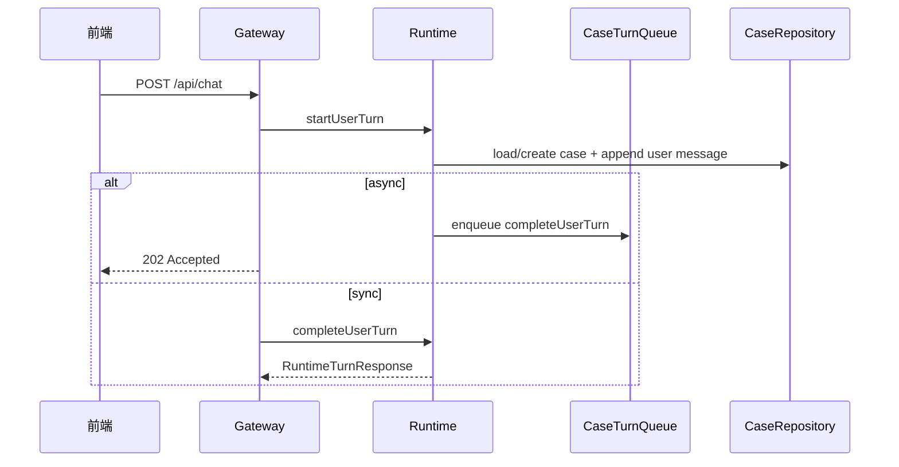

# 输入与会话

## 读者先看

本功能负责把用户输入接入当前 case，并确保同一个 case 的回合顺序可控。它不判断问题能不能回答，也不做证据审核。

## 功能边界

| 负责 | 不负责 |
| --- | --- |
| `/api/chat` 请求进入 Runtime | 判断是否追问 |
| 创建或加载 case | 构造 Worker prompt |
| 写入用户消息和初始日志 | 检索知识库 |
| 同步/异步回合入口 | 审核 claim/evidence |
| 同 case 串行队列 | 生成最终结论 |

## 输入与输出

| 输入 | 输出 |
| --- | --- |
| HTTP chat payload、caseId、persona、workspaceId | `RuntimeTurnResponse` 或 `202 Accepted` |
| 当前 case/session 状态 | 已保存的 user message |
| config 与 repository | 后续阶段可读取的 case context |

## 正常流程

## 失败/降级

| 场景 | 行为 |
| --- | --- |
| case 已归档 | Gateway 或 `SessionLifecycle` 阻止新增回合 |
| async 后台失败 | `recordTurnFailure` 写 helper failure 和日志 |
| 同 case 连续消息 | `CaseTurnQueue` 串行，保证每条 accepted 用户消息都有 helper 回复 |
| Worker CLI 失败 | 不在本层处理；Worker adapter 转成结构化结果后进入 Review |

## 代码入口

### 回合取消

`InvestigationControl` 按 Case 和 userMessageId 持有非持久化 AbortController。Runtime 显式向 Preflight、知识可回答性、历史案例模型阶段及审核表达传递 signal；不在共享 service 中保存可变的当前信号。模型请求前、返回后与失败降级路径检查取消，正式 adapter 可中止响应体读取。

尚未完成审核的结果不能因取消被接受。冻结结果之后的表达取消改用确定性安全渲染；Deep 审核取消保留已有 Fast 初步判断。回合统一收尾，只产生一条绑定回复，旧消息不能取消后续回合。

这不是全部外部工作的即时中止保证：当前 MCP/embedding 传输与旧 allSettled 等待屏障仍有独立治理工作；远端是否停止计费不能由本地 abort 推断。浏览器停止、本地 HTTP 及跨 Case 隔离验收见 `propagate-runtime-model-cancellation` 的实施记录。

- `src/gateway/routes/chat-routes.ts`
- `src/runtime/diagnostic-runtime.ts`
- `src/runtime/turn-queue.ts`
- `src/runtime/session-lifecycle.ts`
- `src/sessions/case-repository.ts`
- `src/sessions/file-memory-store.ts`

## 不负责什么

- 不决定 Preflight 追问或派发。
- 不读取知识库。
- 不调用 Claude Code。
- 不格式化最终用户回复。
- 不把 route DTO 逻辑放进 Runtime。
