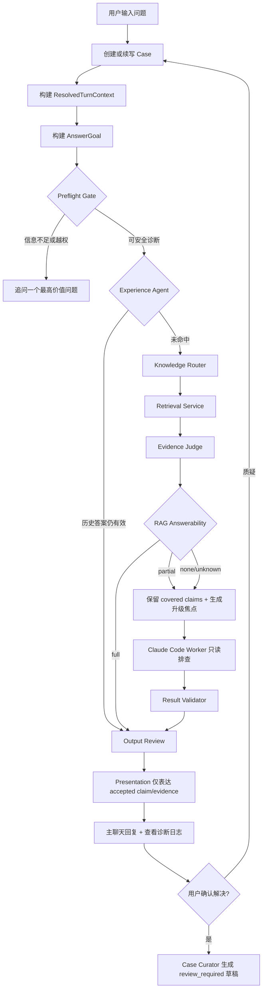
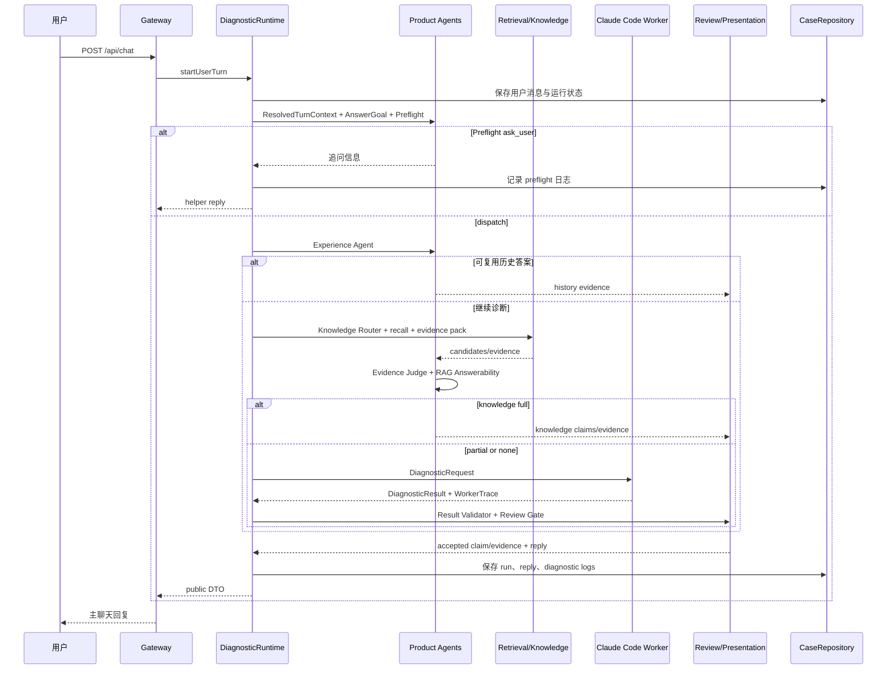

# super helper PRD

## 文档状态

- 文档类型：产品需求文档（PRD）
- 适用范围：`super helper` 本地 MVP 到企业支持首诊助手阶段
- 当前重点：用户输入一个问题后，系统如何通过 Agent、知识库、Worker、证据审核和 Presentation 生成可信回答
- 关联文档：
  - [产品迭代规划](product-evolution-plan.md)
  - [Agent 设计](../agent-design.md)
  - [Agent Runtime 技术总览](../agent-runtime/README.md)
  - [技术架构](../technical-architecture.md)
  - [开发规范](../development-standards.md)

## 1. 产品定位

`super helper` 是企业内部技术支持首诊助手，不是通用 Agent 市场，也不是自动修复工具。

它连接当前项目 workspace、企业知识库、历史 case、只读 MCP 数据源和 Claude Code Worker，让客服、运营、销售、产品、技术支持新人和内部员工能用自然语言提出问题，并得到有证据、可追溯、可升级的回答。

核心承诺：

- 用户只需要描述问题或疑问。
- 系统先判断信息是否足够，不把低价值输入直接丢给 Worker。
- 能由历史答案或知识库回答时，优先复用已审核证据。
- 知识库只能在证据质量、覆盖度和 AnswerGoal 都满足时直答。
- 代码、配置、日志或实现细节不足时，升级给只读 Claude Code Worker 排查。
- 最终回复只能来自已接受 claim 和 evidence，不能靠模型自由发挥。
- 内部过程、工具调用、Worker trace 和审核日志进入 `查看诊断日志`，不污染主聊天体验。

## 2. 背景与问题

企业支持场景里的真实输入通常是不完整的：

- “这个客户说打不开，帮我看下。”
- “课程统计是不是可以补跑？”
- “这个功能到底支持哪些规则？”
- “我不认可上一轮判断，会不会是最近发版引起的？”

如果 Agent 直接猜，会误导用户；如果每次都问一堆信息，用户又会放弃；如果所有问题都交给 Claude Code，成本高、慢，而且答案不可控。

因此产品需要一条可审计的回答链路：

1. 把用户自然语言变成同一个 `AnswerGoal`。
2. 先尝试历史经验和知识库。
3. 证据不足时再升级只读 Worker。
4. 审核 claim、evidence、unknown 和缺口。
5. 用用户能理解的话表达经过冻结的主结论。

## 3. 目标与非目标

### 3.1 产品目标

- 降低技术同事被重复支持问题打断的频率。
- 提升客服、运营、销售、产品和技术支持新人第一次回复的质量。
- 让每个结论都能追溯到 evidence。
- 让“不知道”“证据不足”“需要升级人工”成为可接受的产品状态。
- 把已解决 case 沉淀为可复核知识，而不是直接污染知识库。

### 3.2 当前非目标

- 不做默认写操作或自动修复生产环境。
- 不做多 Agent 市场。
- 不做大而全 MCP 商店。
- 不让 Claude Code 或 MCP 工具直接生成用户最终回复。
- 不让模型绕过 Evidence Review 直接输出最终结论。
- 不把内部 prompt、Worker payload、provider payload 暴露在主聊天中。

## 4. 用户与场景

| 用户 | 核心诉求 | 产品输出重点 |
| --- | --- | --- |
| 客服 | 快速知道该怎么回复客户 | 简短结论、仍需客户补充的信息、可复制话术 |
| 运营/实施 | 判断是配置、数据、使用方式还是系统问题 | 当前判断、证据状态、下一步检查项 |
| 销售 | 回答客户技术问题但不乱承诺 | 有边界的解释、不能确认的部分、升级建议 |
| 产品经理 | 判断缺陷、需求、设计规则或影响范围 | 功能规则、证据来源、产品反馈材料 |
| 技术支持新人 | 找到排查路径并减少漏信息 | 代码/知识证据、未知项、升级材料 |
| 技术负责人 | 降低重复问题和沉淀经验 | case/run/evidence 审计链路、可复用 solved case |

## 5. 核心用户流程

## 6. 回答时序

## 7. 功能需求

### FR-1 Case 会话

- 系统必须以 case 为单位保存用户消息、helper 回复、diagnostic runs、evidence、logs 和状态。
- 同一个 case 的异步回合必须串行处理，确保每条已接受用户消息都有对应 helper 回复。
- 不同 case 可以并发，但不能共享消息、结论或 Worker 输出。
- 归档 case 可读但不可继续对话。

### FR-2 AnswerGoal

- 每个用户回合必须生成 `AnswerGoal`，作为用户可见回答目标的唯一权威。
- `AnswerGoal.mustAnswerItems` 必须被 `primary_answer` claim 覆盖；不能用过程说明替代主答。
- 用户假设不能被提升为已确认事实；不清楚的信息必须保留为 unknown。
- 后续 Experience、Knowledge、Worker、Output Review 和 Presentation 都必须围绕同一个 `AnswerGoal` 工作。

### FR-3 Preflight Gate

- Preflight 必须先于 Worker 调用。
- 当用户输入缺少安全诊断所需的最低信息时，只追问一个最高价值问题。
- 当当前 workspace 已选中且用户提供可搜索业务/技术信号时，不应要求非技术用户证明项目、代码路径或产品归属。
- 用户回答 `不清楚` 是有效输入；系统应把对应字段记为 unknown，并判断是否可低置信继续。
- Preflight 不允许调用 Claude Code 或 MCP 工具。

### FR-4 Experience Agent

- Experience 在 Preflight 后、知识库和 Worker 前执行。
- 只能复用同 tenant/user/workspace 下、source message/run 绑定清楚、仍然可见、未过期、质量合格并覆盖当前 AnswerGoal 的历史答案。
- 复用答案必须转成 `history` evidence，并继续经过 Output Review 和 Presentation。
- 没有安全命中时必须继续正常诊断，不能强行复用。

### FR-5 Knowledge-First 回答

- Knowledge Router 负责识别模块、意图、关键词、projectType 和代码升级信号。
- Retrieval Service 负责 BM25/Embedding recall、RRF fusion、optional rerank、parent 去重和 bounded answer span。
- Evidence Judge 只能允许 active、fresh、质量 `ok|info`、溯源完整、答案片段明确且置信达标的证据进入直答。
- RAG Answerability 必须基于 `AnswerGoal + evidence` 输出 `full | partial | none | unknown`。
- `full` 可以进入知识库直答；`partial` 必须保留 covered claims，并把 missing elements/escalation focus 带给 Worker；`none/unknown` 必须升级或追问。
- 功能概览、规则说明、入口说明类问题不应被强制归类为 bug。
- 补数据、补统计、补跑、队列、脚本、命令类问题必须检查 evidence 是否覆盖步骤、命令、参数和适用条件；仅有页面说明不得直答。

### FR-6 Claude Code Worker

- Worker 是只读诊断工具，不是产品 Agent。
- Worker 只能接收结构化 `DiagnosticRequest`，不能接收未加工的用户聊天作为指令。
- Worker 输出必须是结构化 `DiagnosticResult` 和可脱敏 trace。
- Worker 默认只允许读操作和配置允许的 MCP 工具。
- Worker 不能直接回复用户，不能写 case 主状态，不能作为长期记忆来源。
- 当证据不足但还有安全搜索空间时，runtime 可以发起一次聚焦的 follow-up / Deep Query Retry。

### FR-7 Evidence Review

- Result Validator 必须校验 evidence ID 唯一性、claim evidence 引用、fact 证据强度、claim `role` 和 `answers`。
- `final_answer` 必须有 accepted `primary_answer` claim 覆盖 must-answer 项。
- 无证据 fact 必须被拒绝或降级。
- Evidence Review 必须区分事实、推断、假设和未知。
- 当证据不足但存在 accepted fact/inference 时，回复要先给“初步判断”，再说明不能作为最终结论。
- 内部评分、工具 trace、provider payload 和 rejected claims 只能进入日志/审计层。

### FR-8 Presentation

- Presentation 只能表达 runtime 冻结的 accepted claim IDs 和直接绑定 evidence。
- Presentation 模型输出必须包含 `answerTarget`、`directAnswer`、`reply`、`claimIds`、`evidenceIds`、`directAnswerClaimIds`。
- `directAnswerClaimIds` 必须等于冻结的 primary answer claim IDs。
- 首段必须覆盖 `directAnswer`，完整可见 reply 都必须落在 accepted claims/evidence/missingInfo 内。
- Presentation 不能选择 outcome，不能新增事实，不能靠“能不能/下一步/哪个目录”等自然语言模板选择主答。
- Presentation 校验失败时，系统必须降级到本地格式化回复。

### FR-9 诊断日志与可观测性

- 主聊天只展示用户需要的结论、证据状态、未知项和下一步。
- `查看诊断日志` 展示 preflight、Agent activity、DiagnosticRequest、retrieval trace、Worker 状态、evidence、review、presentation fallback、case curator 等审计事件。
- Worker command、cwd、stdout、stderr、stack 和 provider payload 必须 bounded + redacted。
- Presentation 未通过校验的 raw reply 不得作为可信用户回复进入日志详情。

### FR-10 Case Curator

- 用户确认问题已解决后，系统可以生成 solved case 草稿。
- 草稿默认 `status: review_required`，必须人工审核后才能成为 active knowledge。
- 高风险、证据不足、unsupported fact 或 partial 结果不得自动沉淀为正式知识。

### FR-11 设置与知识库初始化

- Dashboard/Setup 负责绑定 workspace、模型、embedding/rerank、知识库根目录和本地 SecretRef。
- API key 不能写入 public config 或日志；公共 DTO 只能暴露 `hasApiKey`、环境变量名等安全信息。
- 知识库默认隔离在配置的 knowledge root 下，不能默认写入被诊断项目源码目录。
- draft、pipeline、reports、indexes 等知识处理产物必须与正式 active knowledge 区分。

## 8. 输出要求

系统主回复可以是以下类型：

- 追问：只问一个最高价值问题。
- 初步判断：有 accepted fact/inference，但证据不足以最终确认。
- 最终结论：primary answer claim 覆盖 AnswerGoal，且证据充分。
- 操作说明：来自已审核知识或代码证据的步骤、入口、命令、限制条件。
- 升级建议：风险、权限、证据缺口或自动诊断边界明确。

所有输出必须：

- 默认中文。
- 先回答用户原问题，不用过程说明冒充结论。
- 明确 known / inferred / assumed / unknown。
- 不隐藏证据缺口。
- 不暴露内部 prompt、raw provider payload、完整 Worker trace 或敏感字段。
- 支持复制给客户或升级给技术同事。

## 9. 权限、安全与隐私

- 默认只读。
- MCP 按 workspace allowlist 生效。
- 同一 case 串行，不同 case 隔离。
- tenant/user/workspace/case/run 是上下文隔离边界。
- secrets 不得进入 config、日志、DTO、测试 fixture 或用户回复。
- 知识库 draft、repair plan、review record 不得作为高置信直答依据。
- 如果用户请求写生产、删数据、修数据库、发起高风险变更，系统必须拒绝自动执行并建议升级人工。

## 10. 成功指标

- 模糊输入被 Preflight 拦截，且追问具体。
- 有效输入能转成结构化 `DiagnosticRequest`。
- 知识库直答不误用“相关但不回答”的证据。
- partial RAG 信息不会在代码升级后丢失。
- 事实结论 100% 可追溯到 evidence。
- 用户质疑后能开启新 run，并保留旧 run 对比。
- 支持人员能直接复制客户回复或升级材料。
- 重复问题可沉淀为 review-required solved case。
- 技术升级时的信息完整度提升。

## 11. 验收标准

### 输入与 Preflight

- 输入“网站坏了”时，系统追问受影响功能或具体现象，不派发 Worker。
- 输入“课程任务保存失败，接口返回 500”时，系统可在当前 workspace 下派发只读诊断。
- 用户回答“不清楚”时，系统记录 unknown，不编造 traceId、客户环境或日志。

### 知识库直答

- 当知识证据 active/fresh/质量合格/覆盖 AnswerGoal 时，系统可直接回答。
- 当证据只相关但缺少步骤、命令、参数或适用条件时，系统必须 partial 或升级。
- 功能概览类问题可以聚合多条合格 evidence 回答，不强行走 bug 诊断模板。

### Worker 与 Review

- Worker 返回无 evidence 的 fact 时，系统拒绝或降级，不输出最终结论。
- Worker 失败且没有可用证据时，主回复只展示安全失败类别、当前状态、下一步和 case/run 标识。
- 当存在 accepted inference 但证据不足时，主回复以“初步判断”开头并说明证据状态。

### Presentation

- Presentation 模型新增事实时，校验失败并降级本地格式化。
- Presentation 引用了未被 selected claims 绑定的 evidence 时，校验失败。
- 最终回答必须覆盖 `answerGoal.mustAnswerItems` 中已可回答的项，未覆盖项标记 unknown/missing。

### Case Curator

- 用户确认解决后，系统生成 `review_required` solved case 草稿。
- partial、unsupported 或高风险结果不会自动发布为 active knowledge。

## 12. 开放问题

- 团队版的租户、用户、workspace 权限模型何时从本地配置升级为服务端策略？
- MCP read-only 规范是否需要先定义公司内部 schema 和脱敏等级？
- Case Curator 的人工审核 UI 是否纳入下一阶段主工作台？
- 角色化输出是先做 persona-aware reply，还是先做独立“客户回复/升级材料/产品反馈”视图？
