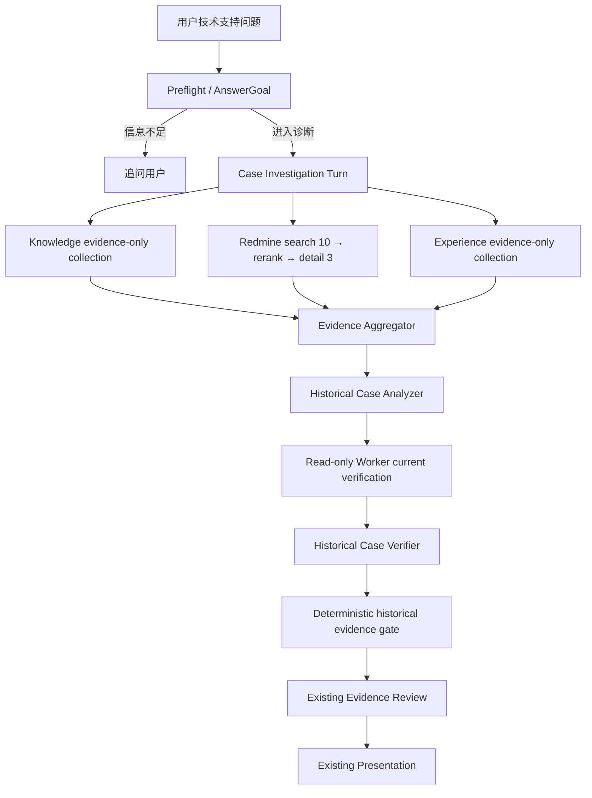

# Redmine 前置历史案例调查设计

日期：2026-08-20

状态：方案讨论已确认，待用户审阅书面设计

## 1. 背景

`super-helper` 当前以 `Experience → Knowledge → MCP → Worker` 串行早停的方式选择答案来源。Knowledge 或 Experience 一旦可以回答，本轮就可能在没有查询 Redmine 的情况下结束；通用 MCP 阶段也不能稳定表达“搜索候选工单、读取详情、形成排查假设、验证当前环境”的完整历史案例调查。

仓库已经完成固定 Redmine 实例和固定项目的只读 REST 连通性穿刺：

- API Key 通过本地 `SecretRef` 解析，不进入仓库或日志。
- Redmine origin 固定为 `https://redmine.codeages.work`。
- 项目标识固定为 `itsupportknowledge`。
- Adapter 只执行 GET，并已验证项目、列表和详情读取能力。

本设计把这项底层能力接入正式 Runtime：所有信息足以进入诊断的技术支持问题，都必须在回答前查询历史工单；历史工单只改变排查方向，不能单独证明当前根因；命中相关案例后，系统自动使用只读 Worker 检查当前代码、配置和日志，再通过既有 Evidence Review 和 Presentation 生成回复。

## 2. 与旧设计的关系

本设计是 `docs/superpowers/specs/2026-07-31-redmine-mcp-case-investigation-design.md` 的收敛版。两者冲突时，以本设计为准。

需要替换的旧决策：

| 主题 | 旧设计 | 本设计 |
| --- | --- | --- |
| Redmine 触发 | 模型选择快速路径或案例调查 | 所有可诊断技术支持问题必须查询 |
| Planner 职责 | 决定是否查 Redmine | 只生成有界搜索查询和 signals |
| 私有备注 | workspace 可配置开启 | 永久排除，不进入任何模型或持久化数据 |
| 当前验证 | 模型可选择是否启动 Worker | 形成有效历史线索后固定启动一次只读 Worker |
| 第一阶段项目范围 | 多项目 alias allowlist | 只支持固定项目 `itsupportknowledge` |
| 快速早停 | Experience/Knowledge 可在 fast path 提前回复 | 一旦进入诊断，必须等待 Redmine 分支明确结束 |

已有 OpenSpec change `add-redmine-case-investigation` 应在实施前按本设计修订，不另建一套互相冲突的 Runtime 合同。

## 3. 已确认的产品决策

| 主题 | 决策 |
| --- | --- |
| 查询范围 | 所有信息足以进入诊断的技术支持问题 |
| 历史案例权威性 | 只提供排查方向；没有当前证据时不判断同因 |
| 当前环境验证 | 命中历史线索后自动进行只读检查 |
| 私有备注 | 永久不读取 |
| 检索深度 | 搜索最多 10 条候选，读取最多 3 条详情 |
| 来源失败 | fail-open；继续 Knowledge 和 Worker，并保留来源缺口 |
| 交互 | 异步执行并展示阶段进度 |
| Redmine 项目 | `itsupportknowledge` |
| 写操作 | Redmine、Worker 和 Runtime 全程只读 |

## 4. 目标

### 4.1 产品目标

- 每个进入诊断的技术支持问题，在正式回答前都有可审计的 Redmine 查询状态。
- 同时使用 Knowledge 和历史工单生成更准确的排查优先级。
- 从最多 10 条候选工单中选择最多 3 条详情，提取历史现象、根因、排查动作、解决动作和反证条件。
- 自动把历史线索转换成结构化只读检查，验证当前代码、配置和日志。
- 清楚区分历史事实、当前事实、推断、假设和未知。
- Redmine 不可用时继续提供有证据边界的服务。

### 4.2 工程目标

- Redmine 协议和凭证边界留在独立 MCP Server，不进入 Runtime、Gateway 或 Worker。
- 保持 `AnswerGoal`、`DiagnosticRequest`、`DiagnosticResult`、`DiagnosticClaim` 和 Evidence Review 合同权威。
- 保持 Gateway response shape、旧配置和旧 Case JSON 兼容。
- 默认构建和测试离线；真实 Redmine 只通过显式验收命令访问。
- 不把原始 Redmine payload、人员身份、私有备注或内部模型 reasoning 写入日志。

## 5. 非目标

第一阶段不包含：

- 创建、更新、评论、关闭或删除 Redmine 工单。
- 自动执行修改配置、修复数据、提交代码或其他有副作用操作。
- 读取私有备注。
- 下载或解析附件正文。
- 把全部 Redmine 工单同步到 Knowledge。
- 接入其他 Redmine 项目、Jira、禅道或其他工单系统。
- 允许 MCP、历史分析 Agent 或 Worker 直接回复用户。
- 仅凭相似度或历史解决方案认定当前问题根因。

## 6. 总体架构



### 6.1 Preflight 边界

Preflight 仍先建立当前回合唯一的 `AnswerGoal`。

- 信息不足、无法形成有意义诊断请求时，可以先追问，不为问候、系统命令或不完整输入调用 Redmine。
- 一旦 Preflight 决定 `dispatch`，案例调查就是默认且必经路径。
- Runtime 不使用中文关键词列表判断是否查 Redmine。
- 后续追问形成新的可诊断问题时，再执行一次新的有界查询。

### 6.2 禁止早停

进入案例调查后：

- Experience 命中只能成为候选证据。
- Knowledge 即使足以回答，也必须等待 Redmine 分支结束。
- Redmine 先完成也必须等待 Knowledge 分支结束或超时。
- 任一来源都不能创建正式回复、完成本轮或绕过 Review。

## 7. Runtime 调查流程

新增 `CaseInvestigationTurnService`，由 `DiagnosticRuntime` 在 Preflight `dispatch` 后调用。复杂流程不得直接堆进 `diagnostic-runtime.ts`。

### 7.1 并行采集

`ParallelSourceCollector` 同时启动三个 evidence-only 分支：

```ts
await Promise.allSettled([
  collectKnowledgeEvidence(request),
  collectHistoricalRedmineEvidence(request),
  collectExperienceEvidence(request),
]);
```

每个来源返回：

```ts
type SourceStatus = 'completed' | 'no_hit' | 'timeout' | 'failed';

interface SourceOutcome {
  source: 'knowledge' | 'redmine' | 'experience';
  status: SourceStatus;
  evidenceIds: string[];
  missingInfo: string[];
  durationMs: number;
  degraded: boolean;
}
```

`timeout`、`failed` 与 `no_hit` 必须严格区分。Collector 在 barrier 后统一组合 context patch，不能让并行分支同时修改同一个 `DiagnosticRequest`。

### 7.2 搜索查询规划

原 Evidence Source Planner 改为 `Historical Search Query Planner`。它不再决定是否查询，只输出：

```ts
interface HistoricalSearchPlan {
  query: string;
  signals: string[];
  statusScope: 'all';
  candidateLimit: 10;
  detailLimit: 3;
}
```

输入只包含：

- `answerGoal.resolvedQuestion`
- `answerGoal.mustAnswerItems`
- 当前 Case 的 confirmed facts、user claims、hypotheses 和 unknowns
- 固定项目能力摘要

Planner 失败、超时或 schema 非法时，Runtime 使用唯一 fallback：

- `query = answerGoal.resolvedQuestion`
- `signals = []`
- `statusScope = all`
- 仍限制为 10→3

规划失败不能跳过 Redmine，也不能提高结论置信度。

## 8. Redmine MCP Server

### 8.1 职责

`src/mcp-servers/redmine/` 负责：

- Redmine REST 认证和固定 GET 请求。
- 固定 origin 与固定项目范围。
- 搜索 backend、分页、历史窗口和缓存。
- 候选与详情 schema。
- 私有备注过滤、字段白名单和结构化截断。
- 候选授权和两个只读 MCP 工具。

它不负责：

- AnswerGoal 或 Runtime 路由。
- 判断历史工单是否与当前问题同因。
- 生成排查结论或用户回复。
- 调用 Workspace Worker。
- Evidence Review 或 Presentation。

### 8.2 工具一：`redmine_search_issues`

输入只允许：

```ts
interface RedmineSearchIssuesInput {
  query: string;
  signals: string[];
  status: 'all';
  limit: number; // 1..10
}
```

工具内部固定：

- origin：`https://redmine.codeages.work`
- project identifier：`itsupportknowledge`
- API Key header：`X-Redmine-API-Key`
- HTTP method：`GET`

工具返回新的 `searchId`、最多 10 条候选和截断状态。候选只保留重排所需字段。

### 8.3 工具二：`redmine_get_issue_case_details`

```ts
interface RedmineGetIssueCaseDetailsInput {
  searchId: string;
  issueIds: number[]; // 1..3
}
```

MCP Server 保存短 TTL 的 `searchId → candidate issue IDs` 授权。详情请求必须满足：

- ID 来自本轮 search grant。
- ID 唯一且数量不超过 3。
- grant 未过期。
- 详情再次验证属于固定项目。

任何条件失败都必须在发出详情请求前拒绝。

### 8.4 搜索 backend

MCP Server 在启动检测时固定使用一个 backend，请求期间不能静默切换：

- `rest_search`：使用 `/search.json`，再验证候选所属数值项目 ID。
- `issues_scan`：使用 `/issues.json`，显式设置 `status_id=*`，按固定项目有界分页，再进行本地词法召回。

如果 `rest_search` 不可用，启动配置选择 `issues_scan`。`issues_scan` 默认使用配置化历史窗口、页数和每页数量；归一化扫描结果可以在进程内缓存 5 分钟，缓存不落盘。

本地运行优先使用 stdio transport。生产需要进程隔离时可以增加带独立 Bearer token 的 Streamable HTTP transport，但 transport 不改变工具合同、项目范围或只读限制。

## 9. 数据合同与隐私

### 9.1 候选合同

```ts
interface HistoricalCaseCandidate {
  issueId: number;
  subject: string;
  status: string;
  tracker?: string;
  priority?: string;
  updatedOn: string;
  descriptionExcerpt?: string;
}
```

候选只用于选择详情，不产生当前根因或最终回复。

### 9.2 详情合同

```ts
interface HistoricalCaseEvidence {
  issueId: number;
  updatedOn: string;
  evidenceBlocks: Array<{
    evidenceId: string;
    kind: 'description' | 'journal' | 'resolution' | 'status_change';
    text: string;
    createdOn?: string;
  }>;
  relations: Array<{ type: string; issueId: number }>;
  attachments: Array<{ contentType?: string; size?: number }>;
  truncation: {
    omittedJournalCount: number;
    omittedAttachmentCount: number;
    truncatedFields: string[];
  };
}
```

### 9.3 永久数据最小化规则

- 私有 journal 永久排除，不提供配置开关。
- 姓名、登录名、邮箱、IP、手机号和人员 ID 不进入 MCP 输出。
- 附件文件名、下载 URL、token、cookie 和正文不进入 MCP 输出。
- 附件只保留 MIME、大小和数量所需信息。
- 自定义字段按显式 allowlist 选择，未知字段默认删除。
- 原始 Redmine payload 和原始错误响应不得进入日志或 Case。
- API Key 只从 `SecretRef` materialize，只进入请求头。

### 9.4 结构化预算

三条详情总预算默认不超过 48,000 个 Unicode 字符。超出时：

- 优先保留基础事实、description、resolution、状态变化和关闭前后的公开 journal。
- 删除完整的低优先级 evidence block。
- 不对序列化后的 JSON 字符串做任意字符切片。
- 始终返回合法 JSON、完整 evidence block 和 truncation metadata。

## 10. 候选重排与历史分析

候选重排 Agent 从最多 10 条候选中选择最多 3 个唯一 ID。比较维度包括：

- 症状与错误信号。
- 产品模块和功能对象。
- 客户或租户上下文中非身份化的技术条件。
- 版本、配置条件和触发路径。
- 工单是否包含明确的公开排查或解决记录。

模型返回未知、重复、非候选或超过上限的 ID 时，Runtime 使用稳定搜索顺序选择最多 3 条，并标记 degraded。

Historical Case Analyzer 只输出结构化排查线索：

```ts
interface HistoricalDiagnosticLead {
  hypothesis: string;
  historicalEvidenceIds: string[];
  matchedSignals: string[];
  conflicts: string[];
  remainingUnknowns: string[];
  checks: Array<{
    checkId: string;
    purpose: string;
    expectedMatch: string;
    expectedMismatch: string;
    action: 'read_file' | 'search_workspace' | 'inspect_config' | 'inspect_log' | 'run_read_only_command';
    permission: 'read_only';
  }>;
}
```

所有历史事实必须绑定存在的 Redmine evidence ID。Analyzer 不能输出最终答案、执行动作或确认当前同因。

## 11. 自动当前环境验证

命中一条或多条通过 schema 和 evidence ID 校验的历史线索后，Runtime 固定执行一次只读 Worker collection：

- 模型不能因为“看起来很相似”或“已有部分证据”而跳过当前验证。
- Worker 必须同时寻找支持条件和反证条件。
- 同一调查回合最多启动一次案例验证 Worker，不能为每条工单各启动一次。
- Analyzer 没有形成有效线索时，不为 Redmine 分支单独启动 Worker；Runtime 仍可根据 Knowledge 缺口进入现有普通 Worker 排查。

Worker 接收 ephemeral、结构化请求：

```ts
interface HistoricalVerificationRequest {
  answerGoal: AnswerGoal;
  hypotheses: Array<{
    hypothesis: string;
    historicalEvidenceIds: string[];
    checks: HistoricalDiagnosticLead['checks'];
  }>;
}
```

该请求只传给 Worker，不完整写入持久化 `DiagnosticRequest`。Worker：

- 只读当前 workspace、日志和配置。
- 不查询 Redmine。
- 不执行写操作。
- 不作最终同因分类。
- 不直接触发 Review、Presentation 或用户回复。

没有历史候选时，Runtime 仍可根据 Knowledge 缺口进入现有 Worker 排查；Redmine `no_hit` 不等于当前问题无法诊断。

## 12. 交叉验证与确定性门禁

Historical Case Verifier 比较：

- Knowledge 产品规则证据。
- 本轮 Redmine 历史 evidence。
- 本轮 Workspace/Log 当前 evidence。
- Analyzer 生成的假设、冲突和 unknown。

允许的内部关系：

- `same_root_cause_likely`
- `same_symptom_different_cause`
- `diagnostic_lead_only`
- `irrelevant`

确定性门禁要求：

- `same_root_cause_likely` 至少绑定一条本轮有效的当前 Workspace/Log evidence 和一条本轮完成的 Redmine MCP evidence。
- 所有引用 ID 必须存在于当前结果及当前 run provenance envelope。
- Worker 反证或关键版本、配置冲突必须阻止同因结论。
- 用户陈述、历史相似度、Knowledge 或旧 Run 不能替代当前 evidence。
- Redmine `timeout/failed` 时不能表达“没有相似工单”。
- 只有历史 evidence 时，最高只能保留 `diagnostic_lead_only`。
- 产品规则或版本适用性判断需要 Knowledge evidence；缺失时必须明确规则证据缺口。

门禁后的结果继续走现有 `validateDiagnosticStructure → Answer Coverage → freezeReviewedDiagnosticResult → safe projection → Presentation`，不能建立第二套最终回复机制。

## 13. 持久化与审计

以下数据只存在于当前 turn 内：

- 搜索 query 和 signals。
- 未选择的候选工单。
- 原始工单详情和未引用 evidence block。
- Agent 原始 reason。
- 完整 Worker 验证计划。
- 未通过校验的假设与模型输出。

正式 Run 可以持久化：

- 经过清洗的 `DiagnosticRequest`。
- Review 使用并接受的有界 evidence block。
- `DiagnosticClaim`、missingInfo 和 source provenance。
- 来源状态、数量、耗时和安全错误码。
- 被选择的工单 ID 和 evidence ID。

不改变现有 Case JSON 顶层 shape。任何新内部字段都应优先保持 turn-local；确需持久化时必须是可选、版本化字段，并增加旧 fixture 兼容测试。

## 14. 超时、重试与降级

| 阶段 | 默认上限 |
| --- | ---: |
| Redmine 搜索 | 8 秒 |
| 候选重排 | 6 秒 |
| 详情读取 | 10 秒 |
| Redmine 分支总预算 | 25 秒 |
| Knowledge/Redmine 并行屏障 | 30 秒 |
| Worker | 沿用现有配置 |

规则：

- 401/403、非法 JSON、schema 错误和范围错误不重试。
- 429/5xx 最多重试一次，遵守 `Retry-After`，但不能突破来源总预算。
- Redmine `timeout/failed` 后继续 Knowledge 和 Worker，并保留来源缺口。
- Worker 无法取得当前证据时，可以输出有历史 evidence 支持的“初步排查方向”，但不能输出当前根因。
- 来源失败不得提升任何 claim 的 confidence。
- 任一来源完成都不能绕过 barrier 提前创建正式回复。

## 15. 异步交互与可观测性

Dashboard 继续复用现有 `async:true → 202 → session polling`，不新增 Gateway 状态机或改变公共 DTO 顶层 shape。

建议阶段文案：

```text
正在查询知识库和历史工单
已找到候选工单，正在选择相关案例
正在分析历史案例中的排查方向
正在根据历史线索检查当前项目
正在交叉验证当前证据
正在审核并组织回复
```

事件 detail 白名单只允许：

- 阶段状态与耗时。
- 候选、详情和截断数量。
- 工单 ID、evidence ID。
- 安全错误码和是否 degraded。
- 是否启动 Worker 验证。

禁止记录 query、signals、工单正文、journal、人员身份、URL、凭证、模型 reason、验证计划和原始错误。

## 16. 模块边界

```text
src/mcp-servers/redmine/
  Redmine REST 协议、搜索 backend、隐私归一化、预算、MCP 工具和 transport

src/mcp/
  通用 MCP Client、workspace/tool allowlist、historical-case capability 和 provenance 转换

src/runtime/case-investigation/
  并行来源采集、案例分析、当前验证、交叉验证和确定性历史证据门禁

src/agents/
  搜索查询规划、候选重排、案例分析和案例验证 Agent 配置

src/workers/
  结构化只读验证计划执行

src/observability/
  阶段事件到用户可见进度的转换
```

Gateway 不实现任何上述业务决策；Knowledge 不调用 Redmine；Worker 不调用 MCP；MCP Server 不导入 Runtime、Gateway、Worker、Session 或 Knowledge。

## 17. Product Agent 变化

新增并登记以下不可产生用户可见文本的 Agent：

- `historical-search-query-planner`
- `historical-case-reranker`
- `historical-case-analyzer`
- `historical-case-verifier`

不再新增拥有“是否进行当前验证”自由裁量权的 Current Evidence Assessor Agent。有效历史线索是否存在由 schema 和 evidence ID 校验确定；一旦存在，Runtime 固定启动一次只读 Worker。

所有 Agent 配置必须位于 `src/agents/` 并登记到 `registry.json`，设置 `mayProduceUserFacingText=false`。

## 18. 启用与配置

Runtime 只通过 workspace 的 historical-case capability 判断该工作区是否接入 Redmine，不读取 Redmine URL、项目 ID 或 API Key：

```yaml
mcpTools:
  - id: company-redmine
    protocol: stdio
    permission: read_only
    enabled: true
    allowedToolNames:
      - redmine_search_issues
      - redmine_get_issue_case_details
    capability:
      type: historical_case
      provider: redmine

workspaces:
  - id: current-workspace
    mcpToolIds:
      - company-redmine
    historicalCaseSources:
      - serverId: company-redmine
```

固定 origin、固定项目和 API Key `SecretRef` 属于 Redmine MCP Server 启动配置，不出现在工具参数或 Runtime 的历史来源配置中。第一阶段不提供 project alias 或私有备注选项。

配置加载边界必须验证：

- server 存在、启用且为 `read_only`。
- capability 精确为 `historical_case/redmine`。
- workspace 同时 allowlist 该 server。
- 两个工具名均在 `allowedToolNames` 中。
- 同一 workspace 只允许一个 Redmine historical-case source。

旧 workspace 缺少 `historicalCaseSources` 时仍可读取，不迁移旧 Case。目标 workspace 在真实验收前必须完成来源配置；配置缺失时记录安全的 `failed/not_configured` 状态并继续 Knowledge/Worker，但不能视为“前置工单查询”验收通过。

## 19. 测试策略

### 19.1 Redmine adapter 与 MCP

- API Key 只进入 `X-Redmine-API-Key`。
- 所有请求固定 origin、固定项目且只使用 GET。
- `status_id=*` 覆盖 open/closed 工单。
- Search API 候选经过项目 ID 二次校验。
- `issues_scan` 分页、历史窗口和内存缓存有界。
- 搜索最多 10 条，详情最多 3 条。
- 详情 ID 必须来自有效 search grant。
- 私有备注和人员字段永久删除。
- 附件不含文件名、URL、token 或正文。
- 48K 预算内保持合法 JSON 和完整 evidence block。
- 错误只返回稳定安全码。

### 19.2 Runtime

- 每个 Preflight `dispatch` 的技术问题恰好发起一次 Redmine 搜索。
- Knowledge、Redmine 和 Experience evidence-only collection 不提前回复。
- Knowledge 与完整 Redmine 分支同时启动。
- barrier 等待各来源 terminal state。
- `timeout/failed` 不转换为 `no_hit`。
- Planner 失败仍执行唯一 fallback 查询。
- 重排非法输出只能选择候选集合内的稳定前三条。
- 形成有效历史线索时固定且最多运行一次案例验证 Worker。
- Worker 同时检查 expected match 和 expected mismatch。
- 仅有历史 evidence 时不能输出当前根因。
- Worker 反证或关键冲突阻止同因结论。
- 整个调查只创建一个 Run、一次 Review 和一条正式回复。

### 19.3 隐私和兼容

- Case、日志和公共 DTO 不含原始 Redmine payload、私有备注、人员身份、内部 reason 或完整验证计划。
- 读取旧配置和旧 Case fixture 不失败。
- `/api/chat`、`/api/session`、`/api/sessions` 和 `/api/logs` response shape 不变。
- 默认 `pnpm test` 不联网、不需要 Redmine API Key。
- 真实验收命令仅执行工具发现、一次有界搜索和授权详情读取。

## 20. 分阶段落地

### 阶段一：对齐现有变更

- 修订 `add-redmine-case-investigation` proposal、design、delta specs 和 tasks。
- 把“模型选择是否查询”改为“所有 dispatch 回合强制查询”。
- 把私有备注策略改为永久关闭。
- 对齐最新 `master` 的只读 probe 和模块边界。
- 检查现有 `codex/redmine-case-investigation` 工作树中的配置代码及未提交修改，不盲目合并或覆盖。

### 阶段二：离线 Redmine MCP

- 扩展现有 GET-only client。
- 实现搜索 backend、隐私归一化、结构化预算和 search grant。
- 暴露两个 MCP 工具和 stdio transport。
- 使用 fixture/fake fetch 完成单元和 transport 测试。

### 阶段三：并行案例调查 Runtime

- 为 Knowledge 和 Experience 增加 evidence-only collect 接口。
- 实现强制案例调查 collaborator 和并行 barrier。
- 增加查询规划、重排、历史分析、自动 Worker 验证和确定性门禁。
- 接入现有 Review/Presentation。

### 阶段四：UI、真实联调与灰度

- 增加安全事件和 Dashboard 进度映射。
- 用当前只读 API Key 执行固定项目真实验收。
- 验证 Search backend、项目范围、私有备注排除、429、超时和负载。
- 先在单个 workspace 启用，再观察延迟、命中率和降级比例。

## 21. 验收标准

- 所有可诊断技术支持问题在正式回复前都有 Redmine `completed | no_hit | timeout | failed` 状态。
- Knowledge 和 Redmine 并行执行，任何来源都不能提前完成回合。
- Redmine 搜索最多 10 条，详情最多 3 条，总详情只能来自本轮候选。
- 私有备注、人员身份、附件正文、凭证和原始响应不会进入模型、日志或公共 API。
- 历史工单只生成排查线索；没有当前 evidence 时不输出当前根因。
- 形成有效历史线索时固定且最多运行一次只读 Worker。
- 当前证据与历史线索冲突时，不输出同因结论。
- Redmine 故障不阻断 Knowledge 和 Worker，并准确表达证据缺口。
- 调查全程只有一次正式 Review、Presentation 和用户回复。
- 旧配置、旧 Case、Gateway response shape 和异步交互保持兼容。
- `pnpm lint`、`pnpm typecheck`、`pnpm build` 和 `pnpm test` 全部通过。
- 真实验收只执行 GET，不产生 Redmine 写操作。

## 22. 风险与缓解

| 风险 | 缓解 |
| --- | --- |
| 每题查询增加延迟 | Knowledge/Redmine 并行、来源总预算、5 分钟内存缓存、异步进度 |
| 历史相似但根因不同 | 当前 evidence 必需、反证检查、确定性门禁 |
| Redmine 不稳定 | fail-open、稳定状态区分、有界重试 |
| Search API 不可用 | 启动时固定 `issues_scan`，请求期不动态扩大范围 |
| 工单内容泄漏 | 永久排除私有备注和身份、字段白名单、turn-local 原始状态、泄漏测试 |
| MCP 详情越权 | `searchId` grant、TTL、最多 3 条、项目二次校验 |
| 并行共享状态竞态 | 各分支返回独立 outcome/context patch，barrier 后统一组合 |
| 改造破坏旧链路 | collect 接口与现有 answer/diagnose 包装分离，兼容测试和全量回归 |
| 现有工作树与 master 漂移 | 实施前先审计 dirty diff，再选择 rebase、摘取或重做，不覆盖用户改动 |

## 23. 设计结论

正式链路应从串行早停改为“Preflight 后强制历史案例调查”：Knowledge、Experience 和 Redmine 并行提供候选 evidence，Redmine 采用 10→3 的受限两阶段读取，历史 Agent 只生成排查假设，命中线索后自动由只读 Worker 验证当前环境，最终仍由现有 Evidence Review 和 Presentation 冻结并表达结论。

这一方案保证每个进入诊断的技术问题都实际查过工单，同时不把历史经验误当成当前事实；它也复用现有 AnswerGoal、Worker、Review、异步会话和安全表达边界，不引入第二套回复系统。
